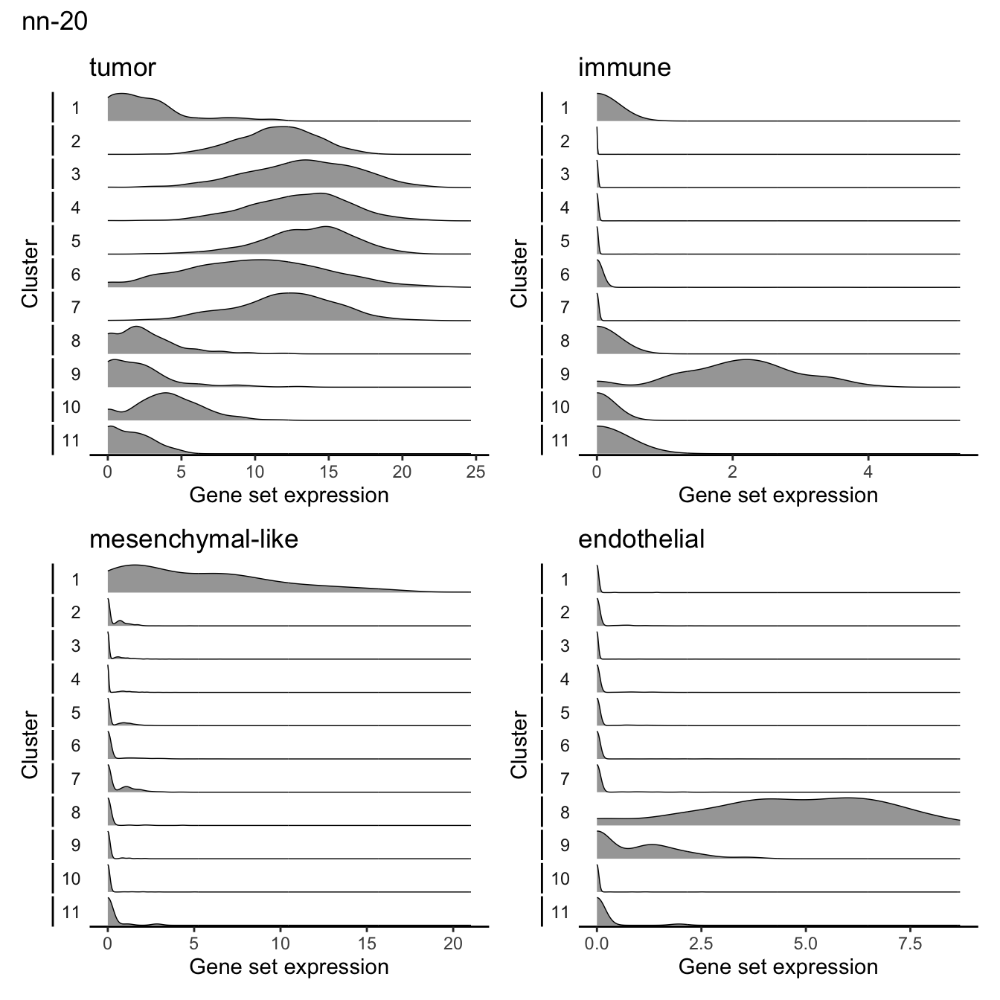

## Setup

```{r packages}
suppressPackageStartupMessages({
  # load required packages
  library(SingleCellExperiment)
  library(ggplot2)
})

# Set default ggplot theme
theme_set(
  theme_bw()
)

# set seed
set.seed(2024)
```


```{r base paths}
# The base path for the OpenScPCA repository, found by its (hidden) .git directory
repository_base <- rprojroot::find_root(rprojroot::is_git_root)

# The current data directory, found within the repository base directory
data_dir <- file.path(repository_base, "data", "current", "SCPCP000015")

# The path to this module
module_base <- file.path(repository_base, "analyses", "cell-type-ewings")

# path to marker genes file
marker_genes_file <- file.path(module_base, "references", "tumor-cell-state-markers.tsv")
```

```{r}
# source in helper functions for make_jaccard_matrix() and jaccard()
jaccard_functions <- file.path(module_base, "scripts", "utils", "jaccard-functions.R")
source(jaccard_functions)

# source in helper functions: plot_density() and calculate_sum_markers()
validation_functions <- file.path(module_base, "scripts", "utils", "tumor-validation-helpers.R")
source(validation_functions)
```

## Prepare data 

```{r}
# sample and library ids
sample_ids <- c("SCPCS000490", "SCPCS000492")
library_ids <- c("SCPCL000822", "SCPCL000824")

# define input sce files
sce_file_names <- glue::glue("{library_ids}_processed.rds")
sce_files <- file.path(data_dir, sample_ids, sce_file_names) |>
  purrr::set_names(library_ids)

# path to cell type classification files
singler_results_dir <- file.path(module_base, "results", "aucell_singler_annotation")
classification_file_names <- glue::glue("{library_ids}_singler-classifications.tsv")
classification_files <- file.path(singler_results_dir, sample_ids, classification_file_names) |>
  purrr::set_names(library_ids)

# path to clustering results files
cluster_results_dir <- file.path(module_base, "results", "clustering", sample_ids)
cluster_file_names <- glue::glue("{library_ids}_cluster-results.tsv")
cluster_files <- file.path(cluster_results_dir, cluster_file_names) |>
  purrr::set_names(library_ids)
```

```{r}
# read in both SCEs
sce_list <- sce_files |>
  purrr::map(readr::read_rds)

# read in classification data frame with SingleR results and combine into one
classification_df <- classification_files |>
  purrr::map(readr::read_tsv) |>
  dplyr::bind_rows(.id = "library_id") |> 
  dplyr::mutate(
    # first grab anything that is tumor and label it tumor
    # NA should be unknown
    singler_annotation = dplyr::case_when(
      stringr::str_detect(singler_annotation, "tumor") ~ "tumor",
      is.na(singler_annotation) ~ "unknown", # make sure to separate out unknown labels
      .default = singler_annotation
    ) |>
      forcats::fct_relevel("tumor", after = 0),
    # get the top cell types for plotting later
    singler_lumped = singler_annotation |>
      forcats::fct_lump_n(7, other_level = "All remaining cell types", ties.method = "first") |>
      forcats::fct_infreq() |>
      forcats::fct_relevel("All remaining cell types", after = Inf)
  )

# read in clustering results and select cluster assignments of interest 
# here we keep leiden-mod, 0.5 res, 20 nn for both libraries 
cluster_df <- cluster_files |> 
  purrr::map(readr::read_tsv) |> 
  dplyr::bind_rows(.id = "library_id") |> 
  dplyr::filter(
    cluster_method == "leiden_mod",
    nn == 20,
    resolution == 0.5
  ) |> 
  dplyr::select(
    barcodes = cell_id,
    library_id, 
    cluster
  )
```

```{r}
# read in marker genes table
marker_genes_df <- readr::read_tsv(marker_genes_file, show_col_types = FALSE) |>
  dplyr::select(cell_state, ensembl_gene_id, gene_symbol) 

# get list of all cell types found
cell_states <- unique(marker_genes_df$cell_state)

# get the sum of expression of all genes for each cell type
gene_exp_df <- sce_list |>
  purrr::map(\(sce) {
    cell_states |>
      purrr::map(\(state){
        calculate_sum_markers(marker_genes_df, sce, state, cell_state)
      }) |>
      purrr::reduce(dplyr::inner_join, by = "barcodes")
  }) |>
  dplyr::bind_rows(.id = "library_id")

# get umap embeddings and combine into a data frame with gene exp, cluster, and cell type assignments 
umap_df <- sce_list |>
  purrr::map(\(sce){
    df <- sce |>
      scuttle::makePerCellDF(use.dimred = "UMAP") |>
      # replace UMAP.1 with UMAP1 and get rid of excess columns
      dplyr::select(barcodes, UMAP1 = UMAP.1, UMAP2 = UMAP.2)
  }) |>
  dplyr::bind_rows(.id = "library_id") |>
  # add in classifications 
  dplyr::left_join(classification_df, by = c("library_id", "barcodes")) |> 
  dplyr::left_join(gene_exp_df, by = c("barcodes", "library_id")) |> 
  # add in cluster assignments 
  dplyr::left_join(cluster_df, by = c("barcodes", "library_id"))
```


assign cells as tumor cells if they belong to a cluster with high tumor marker gene expression 



```{r, fig.height=10}
library_ids |>
  purrr::map(\(id){
    
    
    p1 <- cluster_classification_df |>
      dplyr::filter(library_id == id) |>
      ggplot(aes(x = UMAP1, y = UMAP2, color = singler_lumped)) +
      geom_point(alpha = 0.5, size = 0.1) +
      theme(
        aspect.ratio = 1
      ) +
      scale_color_brewer(palette = "Dark2") +
      labs(title = id) +
      guides(color = guide_legend(override.aes = list(alpha = 1, size = 1.5)))
    
    p2 <- cluster_classification_df |>
      dplyr::filter(library_id == id) |>
      ggplot(aes(x = UMAP1, y = UMAP2, color = as.factor(cluster))) +
      geom_point(alpha = 0.5, size = 0.1) +
      theme(
        aspect.ratio = 1
      ) +
      #scale_color_brewer(palette = "Dark2") +
      labs(title = id, color = "cluster") +
      guides(color = guide_legend(override.aes = list(alpha = 1, size = 1.5)))
    
    patchwork::wrap_plots(p1, p2, nrow = 2)
  })
```


For SCPCL000822, clusters 1, 3, and 4 are tumor 
For SCPCL000824, clustrs 2, 3, 4, 5, 6, 7 are tumor 

```{r}
cluster_classification_df <- umap_df |> 
  dplyr::mutate(
    cluster_classification = dplyr::case_when(
      library_id == "SCPCL000822" & cluster %in% c(1, 3, 4) ~ "tumor",
      library_id == "SCPCL000822" & cluster == 6 ~ "endothelial cell",
      # cluster 2 has predominantly chondrocytes and has MSC marker gene expression
      library_id == "SCPCL000822" & cluster == 2 ~ "chondrocyte",
      # clusters with high "immune" marker gene expression are macrophage
      library_id == "SCPCL000822" & cluster == 5 ~ "macrophage",
      # cluster 8 has high MSC marker gene expression and a mix of MSC like cell types
      library_id == "SCPCL000822" & cluster == 7 ~ "mesenchymal-like cell",
      library_id == "SCPCL000824" & cluster %in% c(2, 3, 4, 5, 6, 7) ~ "tumor", 
      library_id == "SCPCL000824" & cluster == 8 ~ "endothelial cell",
      # cluster 9 has high immune markers and is mostly macrohpages
      library_id == "SCPCL000824" & cluster == 9 ~ "macrophage",
      # cluster 1 has high MSC marker gene expression and a mix of MSC like cell types
      library_id == "SCPCL000824" & cluster == 1 ~ "mesenchymal-like cell",
      # if they didn't have high expression of any markers, we label them as unknown
      .default = "unknown"
    )
  )
```

```{r}
library_ids |>
  purrr::map(\(id){
    cluster_classification_df |>
      dplyr::filter(library_id == id) |>
      ggplot(aes(x = UMAP1, y = UMAP2, color = cluster_classification)) +
      geom_point(alpha = 0.5, size = 0.1) +
      theme(
        aspect.ratio = 1
      ) +
      labs(title = id) +
      scale_color_brewer(palette = "Dark2") +
      guides(color = guide_legend(override.aes = list(alpha = 1, size = 1.5)))
  })
```

```{r}
library_ids |>
  purrr::map(\(id){
    cluster_classification_df |>
      dplyr::filter(library_id == id) |>
      ggplot(aes(x = UMAP1, y = UMAP2, color = proliferative_sum)) +
      geom_point(alpha = 0.5, size = 0.1) +
      theme(
        aspect.ratio = 1
      ) +
      labs(title = id) +
      scale_color_viridis_c()
  })
```


pull out just tumor cells 

```{r}
tumor_cells_df <- cluster_classification_df |> 
  dplyr::filter(cluster_classification == "tumor")

library_ids |>
  purrr::map(\(id){
    tumor_cells_df |>
      dplyr::filter(library_id == id) |>
      ggplot(aes(x = UMAP1, y = UMAP2, color = `EWS-low_sum`)) +
      geom_point(alpha = 0.5, size = 0.1) +
      theme(
        aspect.ratio = 1
      ) +
      labs(title = id) +
      scale_color_viridis_c()
  })
```


