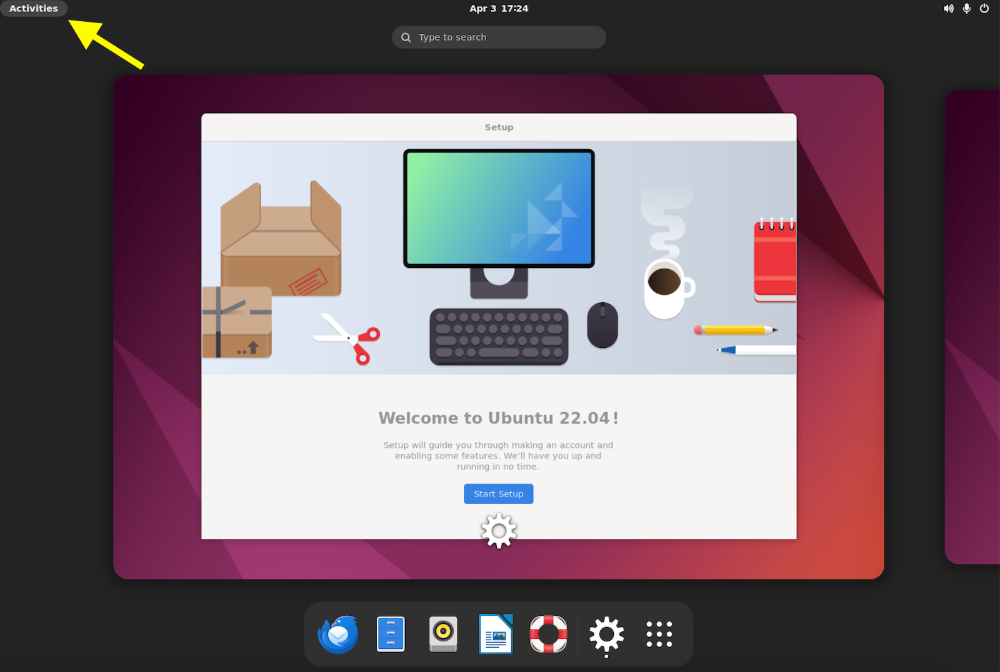
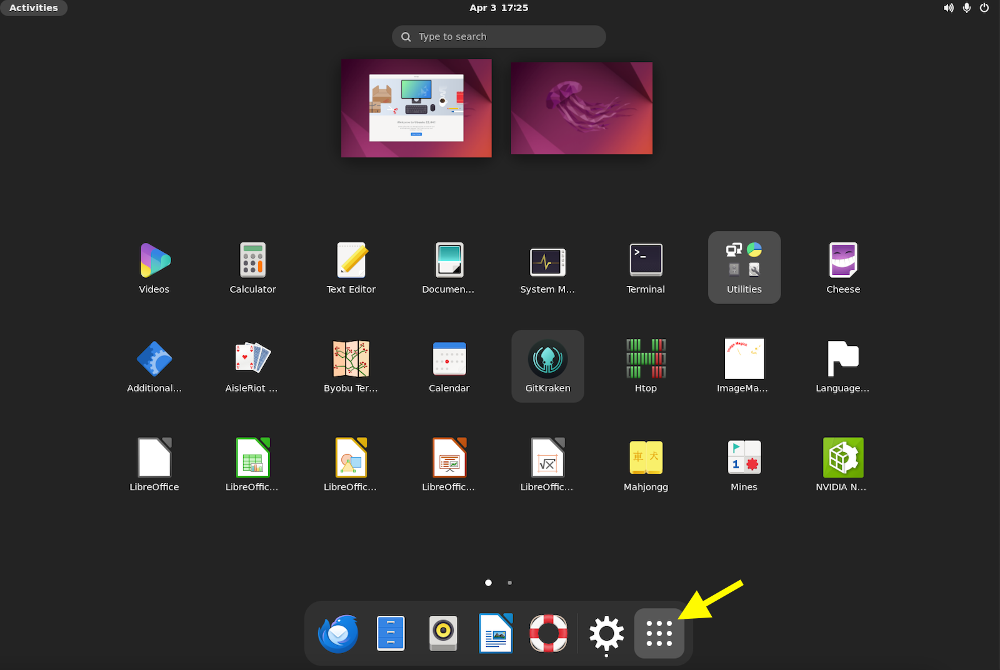

# Developing on virtual computers

Once you have [created a virtual computer](creating-vcs.md), [attached a disk](working-with-volumes.md), and [accessed the operating system](accessing-vcs.md) you are ready to start development on Lightsail for Research by taking the following steps:

1. Cloning the repository to your virtual computer
2. Creating and activating a conda environment
3. Setting up pre-commit

## Quick tips about virtual computers

- Copy and paste need to be synced between your local and remote desktop using the clipboard icon in the upper left hand corner.

    <figure markdown="span">
        {width="400"}
    </figure>

    You will also need to right-click to paste on the virtual desktop; `Ctrl+v` or `Cmd+v` will not work.

- If you use a security key as a multifactor authentication method for GitHub, that will not work on a virtual computer.
Make sure you have another way to login with multifactor authentication, such as an authenticator app.

## Clone the repository

Virtual computers will have Git and GitKraken installed on them.
Click `Activities` on the upper left hand corner of the Ubuntu desktop then click the 9-dot menu to access the applications on the virtual computer.

<figure markdown="span">
    {width="800"}
</figure>

<figure markdown="span">
    {width="800"}
</figure>

Open GitKraken and login using GitHub.

Clone the repository to the volume you created and attached following [the setup instructions for cloning the repository](../../technical-setup/clone-the-repo.md#clone-your-forked-repository).

!!! tip "Using the Git CLI"
    If you prefer to use the command line interface, you can locate and open the Terminal using the same steps (`Activities` followed by the menu).

## Create and activate a conda environment

Conda will be installed on virtual computers, but no setup has been performed.

First, add channels with the following command:

```sh
conda config --add channels defaults
conda config --add channels bioconda
conda config --add channels conda-forge
conda config --set channel_priority strict
```

Create an `openscpca` conda environment using the `environment.yml` file in the root of the `OpenScPCA-analysis` repository.
Use the following command in Terminal, replacing `{your disk's name}` (including the curly brackets) with the name of the disk you cloned the repository to:

```sh
cd ~/{your disk's name}/OpenScPCA-analysis
conda env create -f environment.yml
```

Then, activate the environment with the following command:

```sh
conda activate openscpca
```

## Set up pre-commit

Now that you've installed `pre-commit` into the `openscpca` environment as described above, you can set up `pre-commit` following the instructions in [our documentation](../../technical-setup/environment-setup/setup-precommit.md#set-up-pre-commit).

## Start analyzing

You're ready to start developing on your virtual computer!

Based on the settings `ShutdownIdlePercent` and `ShutdownTimePeriod` you specified when you originally [created the virtual computer](./creating-vcs.md), your computer will shut down automatically after a certain period of low CPU activity.
To instead manually shut down the computer when you're done with a coding session, click the `Stop computer` button from the same screen where you [accessed the virtual computer](./accessing-vcs.md).
