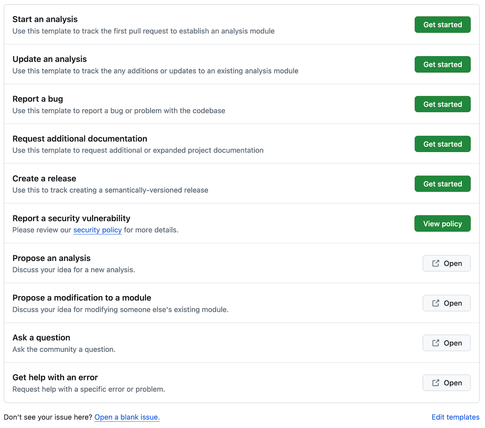

# Issue Templates

We use issue templates to prompt issue authors to include information that helps us accomplish the work tracked in that issue.
Put another way, we have created templates that help us write [good issues](what-makes-a-good-issue.md).

## Selecting a template

When you create a new issue, you will be prompted to select what kind of issue you would like to file.

    <figure markdown="span">
      {width="600"}
    </figure>

The first five entries accompanied with a green `Getting Started` button are the issue templates.
Below, we describe what the options are and how we use them in the project.

## The OpenScPCA templates

### Start an analysis

**Select Start an analysis when you are ready to create an analysis module.**
You should file this only after you've discussed an analysis on GitHub Discussions.

Have the following information ready when you file:

- A link to the GitHub Discussion where you proposed the analysis
- A description of the goals of the analysis (e.g., scientific goals, what the code will do)
- [Software requirements](../../contributing-to-analyses/starting-your-analysis/determining-software-requirements.md)
- What your first pull request will contain

If you know the following, please include it in your issue when prompted:

- [Compute requirements](../../contributing-to-analyses/starting-your-analysis/determining-compute-requirements.md)
- When you expect to file the first pull request

### Update an analysis

**Select Update an analysis when you are ready to make additions or updates to your module.**
If you're brand new to working on a module, please [start by filing a discussion instead](https://github.com/AlexsLemonade/OpenScPCA-analysis/discussions/new?category=modify-an-existing-analysis).

Have the following ready when you file:

- A description of the goals of the changes to the module (e.g., how they relate to the module's overall scientific goals, what the code changes should do)
- What the pull request that closes the issue will contain

If you have or know the following, please include it in your issue when prompted:

- Any additional software requirements
- Any additional compute requirements
- A link to a relevant GitHub discussions thread
- When you expect to file the pull request that will close the issue

### Report a bug

**Select Report a bug when you need to report a bug or problem with the codebase.**
If you are experiencing a different kind of problem, like trouble getting your local computer set up, please [file a discussion instead](https://github.com/AlexsLemonade/OpenScPCA-analysis/discussions/new?category=troubleshooting).

Have the following ready when you file:

- A description of the bug
- The steps necessary to reproduce the bug
- A description of consequences of the bug (e.g., an error message produced)

If you have the following, please include it in your issue when prompted:

- A description of a solution for the bug

### Request additional documentation

**Select Request additional documentation when you what to request additional or expanded documentation.**

Have the following ready when you file:

- An explanation of the documentation improvement or update you would like to see

If you have the following, please include it in your issue when prompted:

- A link to the existing documentation page if you're requesting an expansion or improvement to that page

### Create a release

!!! note

    We don't expect contributors that are not Data Lab staff to use this issue template.

Use this issue template to track creating a semantically-versioned release associated with a project milestone.

### Opening a blank issue

If none of these templates are relevant to the issue you would like to file, scroll all the way down and select Open a blank issue.
Remember to follow [the principles of good issues](what-makes-a-good-issue.md)!
