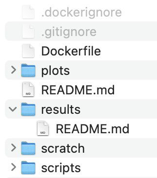

# Analysis modules

This section explains the structure of analysis modules.
Please refer to [this documentation on creating analysis modules](STUB_LINK for creating modules) when you are ready to begin contributing.

<!--TODO: too many links to the same place? -->
Analysis modules will have this baseline file structure, as [created by `create-analysis-module.py`](STUB_LINK for creating modules):

<figure markdown="span">
    {width="200"}
</figure>

## Baseline module files and folders

Analysis modules will contain at least these files:

- **`Dockerfile`**
    - This is the analysis module's [Dockerfile](https://docs.docker.com/reference/dockerfile/) and contains the commands that Docker uses to build the module's Docker image.
    - For more information on how OpenScPCA uses `Docker` images, [please see our `Docker` documentation](STUB_LINK for docker docs).
- **`README.md`**
    - Use this [markdown file](STUB_LINK docs on markdown) to document your analysis module.
  Your `README.md` file should have enough information for other contributors or repository users to learn the following:
        - The scientific goals of the module
        - The input data the module uses and its [computational resource requirements](../starting-your-analysis/determining-compute-requirements.md)
        - How to run the module
    - Please see the documentation on [documenting your analysis module](STUB_LINK module documenting notebooks) for more information about adding to this `README.md` file.
- Hidden files **`.gitignore`** and **`.dockerignore`**
    - We have set up these files to tell Git and Docker, respectively, to ignore certain files that do not belong in version control or in the module's Docker image.
    - These files will likely be automatically hidden from you, but it's useful to be aware that they are there and working behind the scenes to help manage the module!

New analysis modules will also be created with these folders:

- **`plots`**
    - Any plots that your code produces should be saved to this `plots` folder.
- **`results`**
    - Any result files (e.g., TSV files) that your code produces should be saved to this `results` folder.
    - Git will ignore the contents of this folder, _except_ for its `README.md` file, which you can use to document the results files themselves.
- **`scratch`**
    - You can optionally use this folder to store _intermediate_ files that your code produces but are not meant to live in `results` or `plots`.
    - Git will ignore the contents of this folder.
- **`scripts`**
    - You can save any scripts (e.g., `.R`, `.py`, or `.sh`) that you write for your analysis module in this folder.

## Additional files you will add to your module

While you write your analysis, you will add other files too:

- Additional environment files
    - When you [create a module](STUB_LINK for creating a module), you can choose to include files that manage the module's software environment.
    - In this case, your module may also contain contain R-specific (e.g., `renv.lock`) and/or Python-specific (e.g., `environment.yml`) files or folders.
- Analysis notebooks, e.g., R Markdown files or Jupyter notebooks
    - You are welcome to save these files at the top-level of your analysis module folder, or in `scripts`.
    Feel free to choose what location makes the most sense for your analysis, as long as it is all documented in the module's `README.md` file!
    - Please see the documentation on [structuring your analysis notebooks](STUB_LINK structure notebooks) for more information about how to write your analysis notebooks.
- A shell script to run all code in the module
    - If your module has multiple scripts or notebooks, we recommend adding a script (for example a `shell` script) to the top-level of your analysis module folder that will run all scripts in order.
    - You can name this file, for example, `run_<module name>.sh` and document how to run in the module's `README.md`

    !!! note "Naming your files"
        If your module has multiple scripts or notebooks, we recommend naming them in the order they should be run.

        For example, you might have these files in your module (the script names are conceptual!):

        - `scripts/01_script-to-prepare-data.R`
        - `scripts/02_script-to-analyze-data.R`
        - `03_notebook-to-visualize-data.Rmd`

## Example analysis modules

To help you get started, we've created two analysis modules that you can use as references:

- [`hello-R`](https://github.com/AlexsLemonade/OpenScPCA-analysis/tree/main/analyses/hello-R) is an example R-based analysis module
- [`hello-python`](https://github.com/AlexsLemonade/OpenScPCA-analysis/tree/main/analyses/hello-python) is an example Python-based analysis module
