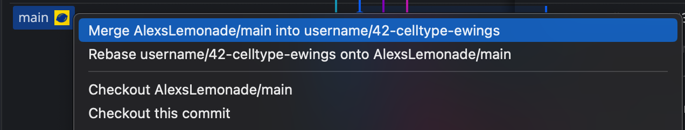

# Before you file a pull request

Before you are able to file a pull request with proposed changes, you will need to complete the following steps:

- Merge any changes from `AlexsLemonade/OpenScPCA-analysis:main` into your [feature branch](../working-with-git/working-with-branches.md).
- Add any results files needed for review to S3.
- Determine software and compute requirements.

## Merge changes from upstream repository

While you have been working on your analysis on your [feature branch](../working-with-git/working-with-branches.md), it's likely that others have also been working in their own feature branches.
Some of their changes may have also been merged into the `main` branch of `AlexsLemonade/OpenScPCA-analysis`.
This means you are now out-of-sync with the `main` branch
You will need to incorporate those changes in `main` into your feature branch before filing a PR.

You can do this in GitKraken by finding the remote copy of the `main` branch in the branch graph (indicated by presence of the ALSF lemon logo).
Right-click on the `main` branch and select `merge AlexsLemonade/main into username/name-of-feature-branch`.

<figure markdown="span">
    {width="600"}
</figure>

After merging, be sure to [push to origin](../working-with-git/push-to-origin.md), ensuring the changes are reflected in the remote copy of your feature branch.

!!! tip

    If GitKraken notifies you of merge conflicts, see our guide on [resolving merge conflicts](./resolve-merge-conflicts.md).

## Add results files to S3

As a contributor to OpenScPCA, you will be provided with an [AWS account](../../software-platforms/aws/joining-aws.md) and access to an [AWS S3 results bucket](../../software-platforms/aws/working-with-s3-buckets.md).

Results files from running your analysis are [not under version control, so they will not be included in your PR](../analysis-modules/index.md#skeleton-analysis-module-contents).
Instead, you will have to save your results files to [your S3 bucket](../../software-platforms/aws/working-with-s3-buckets.md).
Adding your results to S3 allows the Data Lab to access them during code review.

Follow [these instructions to sync your results to S3](../../software-platforms/aws/working-with-s3-buckets.md#syncing-your-results-to-s3) prior to filing your PR.

## Determine software and compute requirements

When filling out the [PR template](./pull-request-template.md) you will be asked to provide information on the computational and software requirements needed for running your proposed analysis.

- See the [documentation on software dependencies](../../ensuring-repro/managing-software/index.md) for how to track, determine, and report your software requirements.
    - Please include any files used to track software requirements, such as `renv.lock` and/or `environment.yml` and `conda-lock.yml`, in your PR.
- See the [documentation on computational resources](../analysis-modules/compute-requirements.md) for how to determine and document computational resources needed for your analysis.
