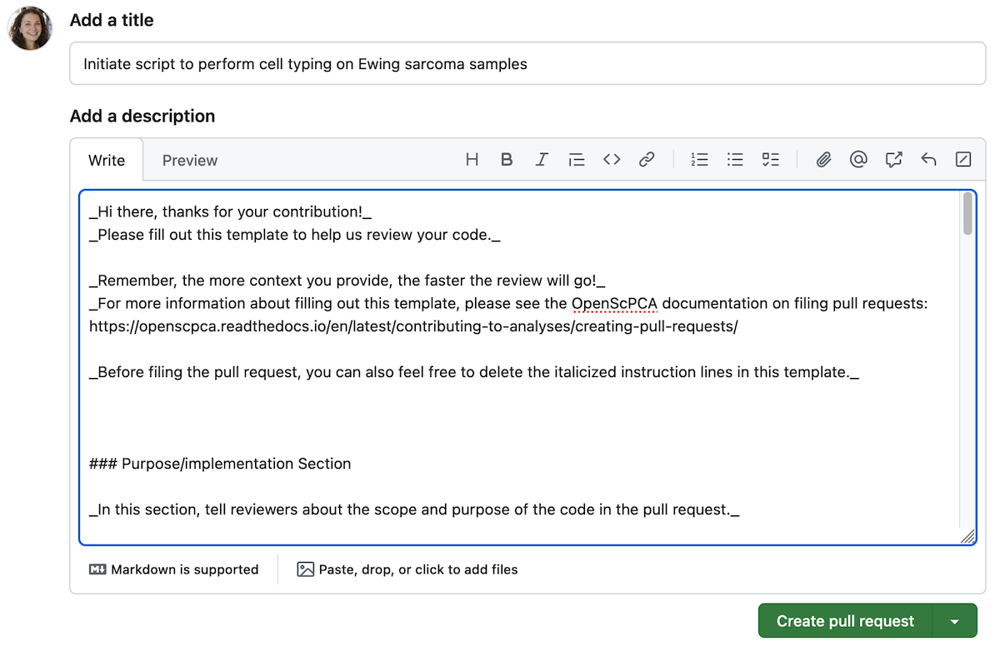

# Filing a pull request

Once you have [committed changes](../working-with-git/making-commits.md) to your [feature branch](../working-with-git/working-with-branches.md) and [pushed to origin](../working-with-git/push-to-origin.md), you are ready to file a PR.

Don't know what to include in your PR or when to file a PR? See our [guidelines on scoping a PR](./scoping-pull-requests.md)!

!!! note "More information on filing a pull request"

    For more on filing a pull request, see the [GitHub documentation on filing a PR](https://docs.github.com/en/pull-requests/collaborating-with-pull-requests/proposing-changes-to-your-work-with-pull-requests/creating-a-pull-request).

## How to file a pull request for OpenScPCA

You should always file PRs from your feature branch in your fork to the `main` branch of `AlexsLemonade/OpenScPCA-analysis`.
Filing a PR is the only way to incorporate any new analysis or code changes into the main code base of OpenScPCA.

Follow the below steps to file a pull request on GitHub:

1. [Commit](../working-with-git/making-commits.md) all changes you plan to include in your PR to your [feature branch](../working-with-git/working-with-branches.md).

1. [Push](../working-with-git/push-to-origin.md) all commits to origin, ensuring that all commits are saved to the remote copy of your feature branch.

1. Navigate to your fork of the OpenScPCA repository on GitHub.

    Once there, use the drop-down menu on the top left to select the feature branch you would like to file the PR _from_.
    This will re-load the page and now display the contents of your feature branch.

    <figure markdown="span">
        {width="300"}
    </figure>

1. Click on the `Contribute` button next to the `Sync Fork` button, and select `Open pull request`.
Any changes found in your feature branch that are _not_ in the `main` branch of `AlexsLemonade/OpenScPCA-analysis` will be included in the PR.

    <figure markdown="span">
        {width="600"}
    </figure>

1. GitHub will then redirect you to the page where you can file your PR.
On this page, you should see:

    - The **base repository** should be `AlexsLemonade/OpenScPCA-analysis`.
        - The **base** field should be `main`.
        - This is the branch you are proposing to merge your changes _into_.
    - The **head repository** should be your fork, `username/OpenScPCA-analysis`.
        - The **compare** field should be your feature branch (here, `username/42-celltype-ewings`).
        - This is the branch with the changes you would like to merge into OpenScPCA's main code base.

    <figure markdown="span">
        {width="700"}
    </figure>

    If you do not see a green check mark with the words `Able to merge`, but instead see a red X and a warning stating `Merge conflicts detected`, you will need to [resolve merge conflicts](resolve-merge-conflicts.md) before you can file the PR.

1. Be sure to provide a descriptive title summarizing your changes and fill out the [PR template](./pull-request-template.md).

    Please follow the instructions in the template and fill it out to completion.

    <figure markdown="span">
        {width="600"}
    </figure>

    Remember, you can always scroll down to below the template and check the contents of your PR look as expected.
    This will show you the history of commits, the number of lines changed, and the line-by-line changes in the code.
    This can also be helpful in ensuring your PR fits our [recommendation of 400 lines or less](./scoping-pull-requests.md#rules-of-thumb-for-good-pull-requests).

2. Once you have completed the PR template, you can press `Create pull request`.

    After filing your PR, the Data Lab team will [review the proposed changes](../pr-review-and-merge/index.md) before changes can be merged into the main code base.

    - You will be able to make additional commits to your feature branch, even after filing your PR.
    - Every time you make a new commit and push to origin, it will now be reflected in your PR.
    - This is particularly helpful when making changes in response to [review comments](../pr-review-and-merge/index.md).

You have now successfully created a pull request!
