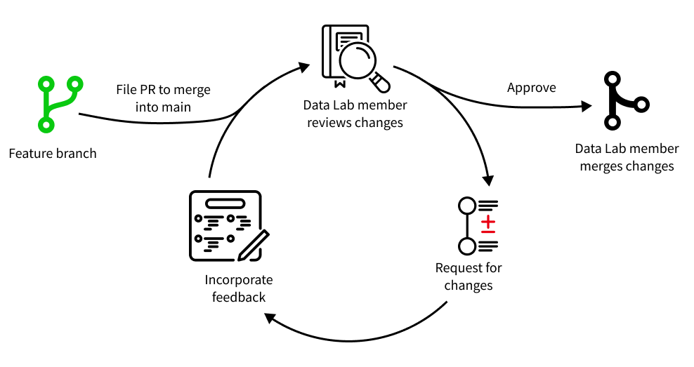

# Creating pull requests

## What is a pull request?

A pull request (PR) is used to propose merging new changes saved in one branch into another branch.
In other words, you file a PR to _request_ that your code be _pulled_ into another branch.
In most cases, PRs are used to merge in changes from a [feature branch](../working-with-git/working-with-branches.md) into the `main` branch of the repository.

You can file PRs on GitHub and [request review](../pr-review-and-merge/index.md) to ultimately be able to merge your code.
The following components will be present in each PR:

- A summary of line-by-line differences between the feature branch and the main branch, created by GitHub.
- A summary, written by the contributor, describing the contents of changes proposed in the pull request.
- A history of all commits made on the feature branch, created by GitHub.

!!! note "Learn more about pull requests"
    For more details on pull requests, see:

    - [GitHub's documentation describing pull requests](https://docs.github.com/en/pull-requests/collaborating-with-pull-requests/proposing-changes-to-your-work-with-pull-requests/about-pull-requests)
    - [Tutorial on pull requests from GitKraken](https://www.youtube.com/watch?v=2VX1ISk9XH8&t=1s)

## Using pull requests in OpenScPCA

Once you have created a [feature branch](../working-with-git/working-with-branches.md) and [committed changes to that branch](../working-with-git/making-commits.md), you will file a PR to merge those changes into the `main` branch of `AlexsLemonade/OpenScPCA-analysis`.

- Each PR contains a group of related changes to the code.
    - Not sure what to include in your PR?
    See [scoping a pull request](scoping-pull-requests.md).
- Each PR includes a description of the changes made.
    - We provide a [pull request template](pull-request-template.md) to guide you on what to include in your pull request description.
- All PRs are [reviewed](../pr-review-and-merge/index.md) by at least one Data Lab staff member before they can be approved.
Once approved, a Data Lab staff member will merge your feature branch into the `main` branch of `AlexsLemonade/OpenScPCA-analysis`.

## The pull request review process

<figure markdown="span">
    {width="700"}
</figure>

We require that [at least one Data Lab staff member review](../pr-review-and-merge/index.md) the content of all PRs.
We will review your code contribution by:

- Checking for correctness, clarity, and reproducibility in the code
- Evaluating methods and rationale for any proposed analysis
- Ensuring that all necessary documentation is present and clear

If the reviewer has comments or requests changes, you should address those comments before requesting a second review.
Bear in mind that it is _normal and expected_ for a pull request to undergo multiple rounds of review before it is approved.
Once the reviewer is happy with the changes, they will approve the pull request and [merge](../pr-review-and-merge/index.md). <!-- STUB_LINK: Update to merge link -->

Then, your code contributions will be present in the `main` branch of `AlexsLemonade/OpenScPCA-analysis` 🎉 !
