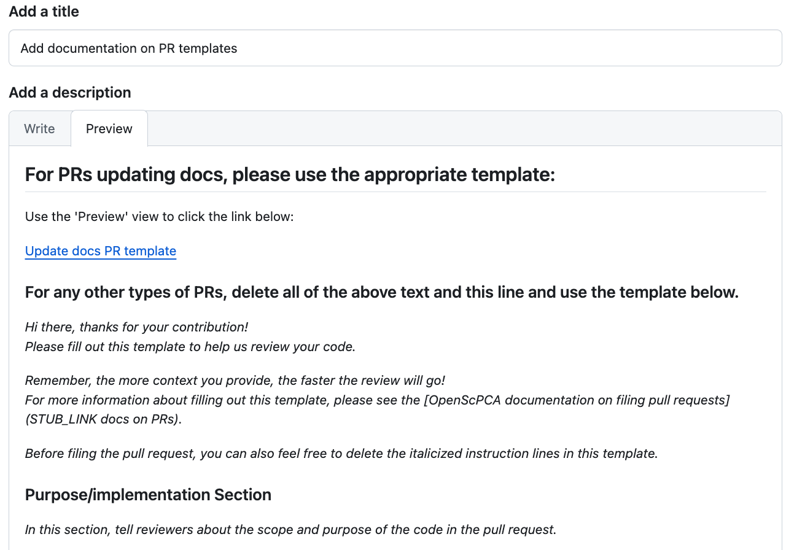

# Pull request templates

## What is a pull request template?

When [filing a PR](STUB-LINK file a PR), GitHub will ask you for an informative title and description of the changes.
There is lots of other information you can include in your PR, including items you want reviewers to have a particularly close look at, or any other technical information that will help the review process go more smoothly.
In OpenScPCA, we use a pull request template to directly prompt you for important kinds of information that will help us review your code!

- When you go to file the PR, there will be a box for you to include the PR description.
This box is already populated with a set of text prompts and questions to answer - this is the PR template!
- Every time that you file a new PR, the same template will appear.
- Answer the questions when writing up your description and then file your PR.

## Why are pull request templates helpful?

- PR templates help guide contributors on what points to include in the description of their PR.
- By providing the same set of prompts for each PR, it ensures that all PR descriptions cover the same set of minimum information.
Some examples of prompts typically seen in a PR template include:
    - The purpose of the changes made in the PR.
    - A description of the results or outcome of these changes.
    - Instructions for reviewers.
- They sometimes contain checklists for contributors and reviewers.
    - These can be helpful to make sure that you have included all the required items and adhered to the guidelines.
- Templates make filing PRs much easier for you as well, because they tell you exactly what kind of information you should provide.

## How do I use the pull request template for OpenScPCA?

Every time you file a new PR in OpenScPCA, you will be prompted to fill out the provided PR template.

See below for an example of what you will see when filing a PR for OpenScPCA.
Note that this figure shows what the template looks like if using the `Preview` tab.
To edit the template, use the `Write` tab.

<figure markdown="span">
    {width="600"}
</figure>

This PR template includes the following sections:

- Instructions for filling out the template (in italics)
    - After reading, you can delete these instructions before filing the PR.
- A summary of the purpose and goals of this PR.
    - Here you would include some background information on the changes you're proposing such as the general approach you took.
- A summary of the results from this PR.
    - This includes information on what results or output your code in the PR produces and where the results live.
- Directions for reviewers.
    - Include any computational resources and software requirements needed to run the analysis.
    - Here is where you would bring up any points that you would like to discuss further or would like reviewers to pay special attention to.
- Author checklists.
    - Check off the boxes that apply to your PR.
    - These checklists ensure that your code meets the required guidelines, the reviewer can access the results, and your code is reproducible.
