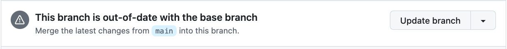
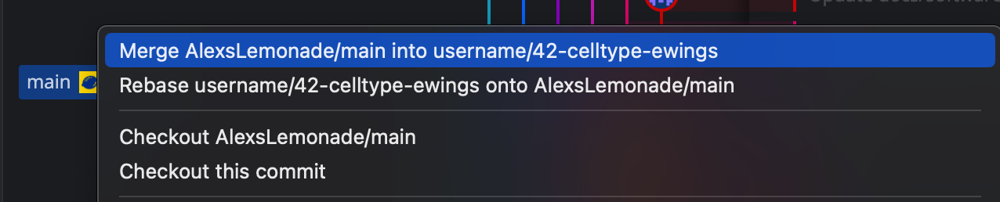

# Resolving merge conflicts

## What is a merge conflict?

A merge conflict can arise when attempting to merge two branches that have conflicting changes.
When a merge conflict is detected, Git does not know which changes should be incorporated into your commit.
You will be asked to resolve this conflict and select the changes that should be kept.

For example, there may be a change to a line on the `main` branch that conflicts with a change you have made to the same line on your feature branch.
This must be resolved, before your feature branch can be merged into `main`.

For more on merge conflicts, see the [GitHub documentation on merge conflicts](https://docs.github.com/en/pull-requests/collaborating-with-pull-requests/addressing-merge-conflicts/about-merge-conflicts).

## When might you see a merge conflict?

These conflicts are likely to arise if another PR with changes to the same section of code you are working on gets merged into `main` before your changes are merged.
This can happen if:

- The conflicting PR is merged while you are still working on your feature branch, prior to [filing a PR](./file-pull-request.md).
    - Merge `main` into your feature branch [prior to filing the PR and resolve any conflicts](STUB-LINK to before you file).
- The conflicting PR is merged while your PR with proposed changes is under review.
    - If GitHub prompts you that your branch is out-of-date with the base branch, press `Update branch`.

    <figure markdown="span">
        {width="600"}
    </figure>

If merged conflicts are detected when performing either of these tasks, please resolve them following the instructions below.

## How to resolve a merge conflict

If a merge conflict is detected, we recommend using GitKraken.
Do _not_ attempt to resolve the conflict using the GitHub interface, as it can be easy to make mistakes and miss conflicts.

1. Navigate to GitKraken and check out the branch that you are working on.

1. Attempt to merge `AlexsLemonade/OpenScPCA-analysis` into your feature branch.
To do this, right-click on the remote `main` from `AlexsLemonade/OpenScPCA-analysis` and select `merge AlexsLemonade/main into feature-branch-name`.

    <figure markdown="span">
        {width="600"}
    </figure>

1. A banner will pop up indicating that there is a merge conflict.
Any files that contain conflicts will be listed on the right-hand side under `Conflicted files`.

    <figure markdown="span">
        {width="400"}
    </figure>

    <figure markdown="span">
        {width="400"}
    </figure>

    To learn how to resolve these conflicts, please watch this [tutorial from GitKraken](https://www.gitkraken.com/learn/git/tutorials/how-to-resolve-merge-conflict-in-git).

1. Once you have resolved the conflicts and committed the changes, your feature branch will now be in sync with the most recent changes in the `main` branch of `AlexsLemonade/OpenScPCA-analysis`.
You should then [push these changes to GitHub](./push-to-origin.md), to ensure that both the local and remote copy of your feature branch contain the most recent changes in `main`.
