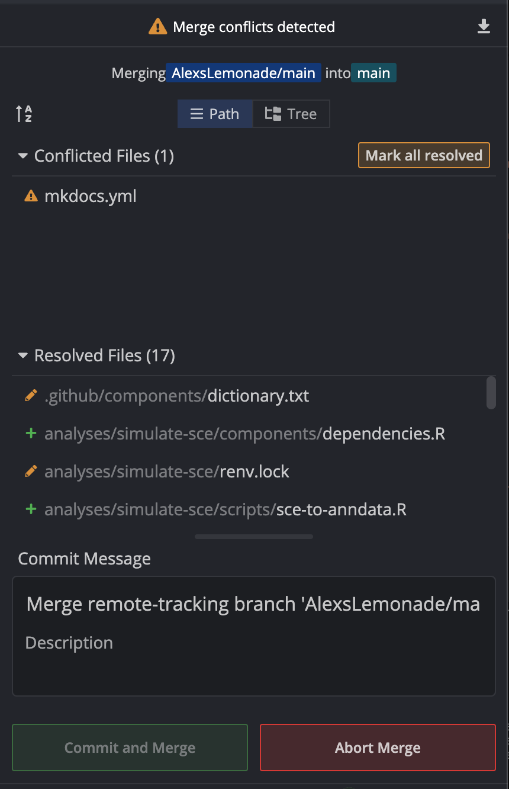

# Resolving merge conflicts

## What is a merge conflict?

A merge conflict can arise when attempting to merge two branches that have conflicting changes.
When a merge conflict is detected, Git does not know which changes should be incorporated into your commit.
You will be asked to resolve this conflict and select the changes that should be kept.

For example, there may be a change to a line on the `main` branch that conflicts with a change you have made to the same line on your feature branch.
This must be resolved, before your feature branch can be merged into `main`.

!!! note "More information on merge conflicts"
    For more on merge conflicts, see the [GitHub documentation on merge conflicts](https://docs.github.com/en/pull-requests/collaborating-with-pull-requests/addressing-merge-conflicts/about-merge-conflicts).

## When might you see a merge conflict?

These conflicts are likely to arise if another PR with changes to the same section of code you are working on gets merged into `AlexsLemonade/OpenScPCA-analysis:main` before your changes are merged.
This can happen when both you and a different contributor are working on the same area of code at the same time.
If their branch is merged into the `main` branch of the upstream `AlexsLemonade/OpenScPCA-analysis` repository while you are still working on your analysis and/or while your code is still under review, you may see a merge conflict.

<figure markdown="span">
    {width="500"}
</figure>
Figure from https://blog.developer.atlassian.com/a-better-pull-request/.

To resolve merge conflicts, you need to merge the upstream `main` branch into your feature branch.
If Git finds merge conflicts, you can then resolve them in GitKraken, as described below.
_We strongly recommend doing this [before you file a PR](STUB_LINK before you file)._

## How to resolve a merge conflict

We recommend using GitKraken to resolve merge conflict.
Do _not_ attempt to resolve the conflict using the GitHub interface, as it can be easy to make mistakes and miss conflicts.

1. Open your fork in GitKraken and check out the feature branch that you are working on.

1. Attempt to merge `AlexsLemonade/OpenScPCA-analysis:main` into your feature branch.
To do this, right-click on the remote `main` from `AlexsLemonade/OpenScPCA-analysis` (indicated in GitKraken with the ALSF lemon logo) and select `merge AlexsLemonade/main into feature-branch-name`.

    <figure markdown="span">
        {width="600"}
    </figure>

1. A banner will pop up indicating that there is a merge conflict.
Any files that contain conflicts will be listed on the right-hand side under `Conflicted files`.

    <figure markdown="span">
        {width="400"}
    </figure>

    <figure markdown="span">
        {width="400"}
    </figure>

    To learn how to resolve these conflicts, please watch this [tutorial from GitKraken](https://www.gitkraken.com/learn/git/tutorials/how-to-resolve-merge-conflict-in-git).

1. Once you have resolved the conflicts and committed the changes, your feature branch will now be in sync with the most recent changes in the `main` branch of `AlexsLemonade/OpenScPCA-analysis`.
You should then [push these changes to GitHub](./push-to-origin.md), to ensure that both the local and remote copy of your feature branch contain the most recent changes in `main`.
