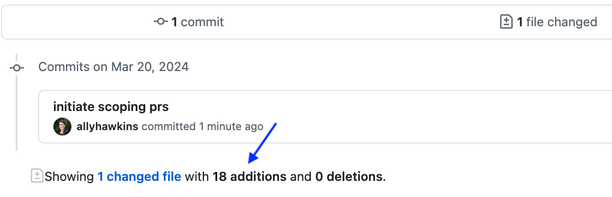

# Scoping a pull request

## What to include in a pull request

All changes in a given PR should be focused with a set of related changes.
For most cases, each PR should contain changes that address one [issue filed in the repository](../../communications-tools/github-issues/what-are-github-issues-and-how-do-we-use-them.md).

Ensuring your PRs are focused on one task helps combat reviewer fatigue and keeps the [review process](STUB-LINK to review) short.
Longer PRs are harder and more time-consuming to review, and reviewers are more likely to miss catching unwanted bugs in the code.
The smaller the PR, the faster and more thorough the review!

For example, if you are working on adding an [analysis module](STUB-LINK to analysis modules), you may file the following PRs:

- The first PR should include [your initialized analysis module](STUB-LINK to creating analysis module), including the skeleton of the module folder and a description in the `README.md` file.
- The second PR may include a script (and any accompanying documentation) that performs the first step of the analysis.
- Subsequent PRs can add in any additional scripts, where each PR adds a single step in the analysis.

## Rules of thumb for pull requests

Below are some good rules of thumb to follow when determining when to file a PR:

- The total number of lines that are changed should be less than 400.

    When preparing to file a PR on GitHub, you can scroll below the template description to see the summary of commits and changes.
    Below the summary of all commits, GitHub displays a summary of your line-by-line changes, including the number of lines with additions and deletions.
    In the example below, 18 lines have been changed.
    You can view this before filing your PR to ensure you have a PR that is appropriate length.

    <figure markdown="span">
        {width="600"}
    </figure>

- The contents of the PR address the contents of a single issue and solve one problem.
This means for each issue, there is one PR that addresses that issue.
_Please do not_ file PRs that address multiple issues at once.

