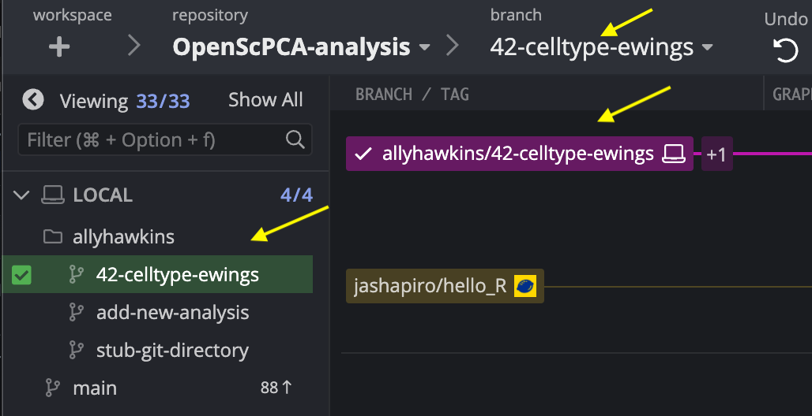
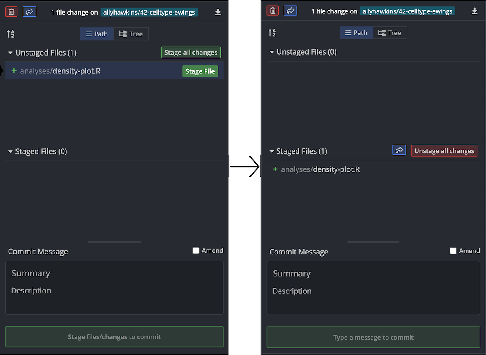

# Making commits

Once you have added code for your analyses (or made changes to existing code) that you are happy with, you will need to commit your changes to your feature branch.
A commit in Git ensures that the new file or changes to an existing file are saved.
For each commit, a unique ID, or hash, will be assigned to identify that commit, allowing you to easily track changes.

!!! note
    For more information on commits, see [GitHub's documentation on commits](https://docs.github.com/en/pull-requests/committing-changes-to-your-project/creating-and-editing-commits/about-commits).

## How to make a commit

After making sure you have selected the correct feature branch, follow these steps to make a commit to your branch on GitKraken.

1. Hover over any files you wish to commit and select the `Stage File` button.
This will move that file from the `Unstaged Files` area to the `Staged Files` area.
Any files that are in the `Staged Files` section will be included in your commit.
If you wish to include all changes to all files, use the `Stage all changes` button.

<figure markdown="span">
    {width="600"}
</figure>

<figure markdown="span">
    {width="600"}
</figure>

2. Write a commit message by filling in the `Summary` box.
This should be a short message that describes what changes are being made with that commit.

<figure markdown="span">
    {width="600"}
</figure>

3. Click on `Stage files/changes to commit` to make the commit.
This action ensures that your commit, and any changes associated with that commit, is saved to your branch.
You should now see a new line with your commit message connected to your branch name in GitKraken.

<figure markdown="span">
    {width="600"}
</figure>

You have now successfully committed your changes to your feature branch!
If you still have questions, check out [this tutorial on making commits with GitKraken](https://www.gitkraken.com/learn/git/tutorials/how-to-git-commit).
