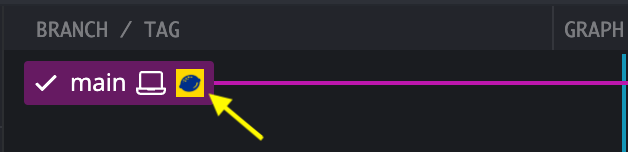
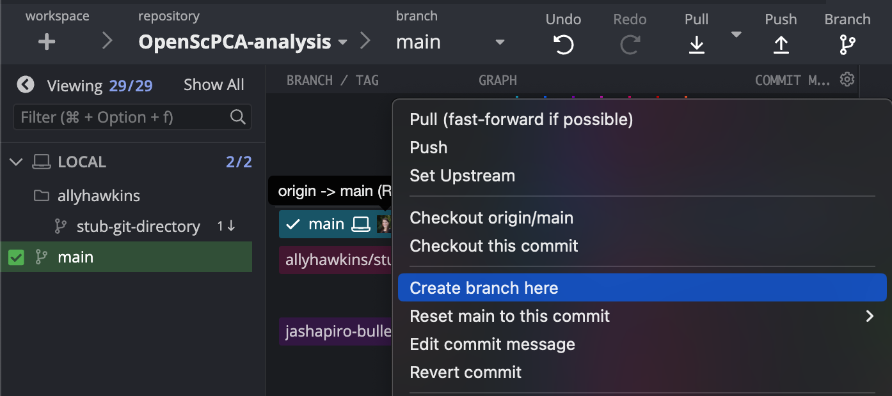

# Working with branches

A branch in GitHub refers to an isolated copy of the repository contents.
For example, the `main` branch of the `OpenScPCA-analysis` repository contains the main copy of all items in the repository.
Before making any changes to the `main` branch, we can create a feature branch containing a copy of the code in the `main` branch in an isolated space.
This allows you to make changes to the code on the feature branch without affecting the code in the `main` branch or interfering with others as they make changes.

!!! note
    For more details on branches, see [GitHub's documentation describing branches](https://docs.github.com/en/pull-requests/collaborating-with-pull-requests/proposing-changes-to-your-work-with-pull-requests/about-branches).

When you are working on your own analyses or proposing a change to the main codebase, we ask that you first fork the repository (see [Forking the repo](STUB-LINK)) and then create a feature branch from the `main` branch of your fork.
Any changes that you make should then be incorporated or added to that feature branch (see [Making commits](STUB-LINK)).
Once your analysis or changes are complete, then you will create and file a pull request to the `main` branch of `OpenScPCA-analysis` to request to incorporate your additions into the main code base (see [Creating pull requests](STUB-LINK)).

## Creating a feature branch

Follow these steps to create your feature branch:

1. Open the GitKraken GUI interface and make sure you are on the `main` branch of your fork of `OpenScPCA-analysis`.
You can do this by checking the `main` box listed under the `Local` menu.

<figure markdown="span">
    {width="600"}
</figure>

2. Create a and checkout a new branch by right-clicking on the `main` branch and selecting `Create branch here`.

<figure markdown="span">
    {width="600"}
</figure>

3. You will then be prompted to name your branch.
We encourage users to name their branch using their github username followed by a description of what changes will be included in the branch, e.g., `allyhawkins/add-new-analysis`.

<figure markdown="span">
    {width="600"}
</figure>

You have now successfully created a new branch and are free to make changes to the code and continue with your analysis!
If you still have questions, check out [this tutorial on creating branches with GitKraken](https://www.gitkraken.com/learn/git/problems/create-git-branch).
