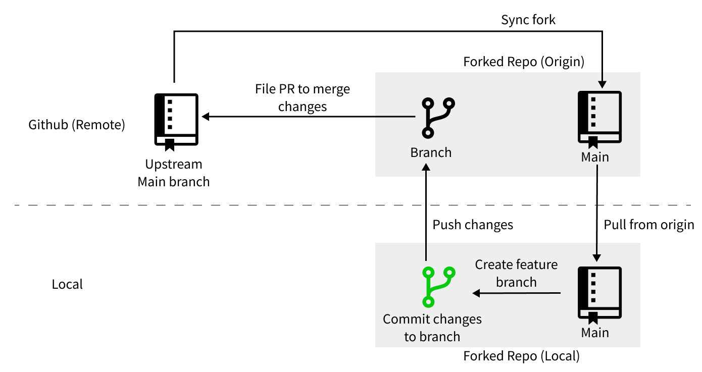

# Contributing to analyses

This section contains information about how to create, contribute to, and/or run an analysis module using the Git/GitHub framework.

All instructions in this section assume you have already:

1. Been [onboarded to the project](https://share.hsforms.com/1MlLtkGYSQa6j23HY_0fKaw336z0) as a new contributor
2. Taken all [set up steps](../technical-setup/index.md) to work on the project
3. [Discussed your proposed analysis on GitHub](../communications-tools/index.md#github-discussions)
4. [Filed an issue](../communications-tools/github-issues/index.md) that tracks steps you'll take to perform your analysis

Once you have an issue to work off of, you're ready to go!

## Project Overview

The image below provides a high-level overview of the Git/GitHub aspects of the project workflow.

<figure markdown="span">
    {width="1000"}
</figure>

You will contribute to the project as follows:

1. [Create a feature branch](working-with-git/working-with-branches.md) in your fork to begin your analysis (but see the [helpful tips](#helpful-tips) below!)
1. [Create a new analysis module](analysis-modules/creating-a-module.md) (unless you are working on an existing module)
1. Perform your analysis using Git:
      - [Commit](working-with-git/making-commits.md) small units of work, [pushing](working-with-git/push-to-origin.md) your commits to your fork on GitHub along the way
      - Be sure to [document](analysis-modules/documenting-analysis.md) module as you build it up
1. When you've [completed enough work for a pull request (PR)](creating-pull-requests/scoping-pull-requests.md), you'll [file a PR](creating-pull-requests/index.md) to the upstream repository, `AlexsLemonade/OpenScPCA-analysis`
1. The Data Lab will then [review your PR](STUB_LINK)
1. Once we approve your PR, we will merge your feature branch into the upstream `AlexsLemonade/OpenScPCA-analysis` repository
1. Finally, you'll [sync your fork](working-with-git/staying-in-sync-with-upstream.md) with the upstream repository
    - Then, rinse and repeat - make your next feature branch and begin again!

## Helpful tips

- Please review the documentation in the [**Analysis Module**](analysis-modules/index.md) and [**Determining analysis requirements**](determining-requirements/index.md) sections before you create your module.
    - This information will help orient you to how to write OpenScPCA analysis modules and ensure they meet the project's reproducibility requirements

- Before you dive into an analysis, take some time to [plan your work](creating-pull-requests/scoping-pull-requests.md).
     - Focused units of work will make [the pull request process](creating-pull-requests/index.md) go more smoothly and more quickly!
     - You should expect that for each analysis you work on, you will go through several iterations of feature branches and PRs.
   You'll save time and energy in the long-run by thinking a little bit about what each branch, and therefore each PR, will contain.

- Before you file a pull request, we strongly recommend [syncing your branch with the upstream repository](working-with-git/staying-in-sync-with-upstream.md).
    - This will reduce odds of having a [merge conflict](creating-pull-requests/resolve-merge-conflicts.md), which can be tricky to deal with (but we're here to help!)
    - You can also periodically sync up while you're working on your analysis to even further reduce the chances of having a merge conflict

- Remember, we're here to help!
    - Refer to our [Getting Help](../troubleshooting-faq/index.md) section at any time to learn about different ways to get help from the Data Lab as you work on your analysis.