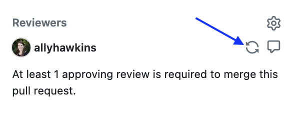

# Responding to code reviews

After you file your PR, the Data Lab team will assign a reviewer to your pull request.
We aim to begin the process of code review within three business days of you filing the PR.
You can expect that each PR will have undergo several rounds of code review and response to review

Your reviewer will evaluate the code and/or documentation in your PR for the following considerations:

- **Context**
    - Has enough information been provided for the reviewer to fully understand the scope and context of what they are reviewing?
    If not, your reviewer's initial code review will likely request additional information to be able to perform review.
- **Clarity**
    - Is the code readable, reasonably efficient, and well-commented?
- **Reproducibility**
    - Can the code be re-run to successfully generate the same results?
- **Documentation**
    - Are the code and results (if applicable) clearly documented?
    - Are the steps to set up the code environment and run the code clearly documented?
- **Code checks**
    - We have set up several automated checks using GitHub actions for code quality control.
    If any of these automated checks fail, your reviewer may include feedback about what changes you may need to make for code checks to pass.

## Responding to review

Responding to code reviews establishes a conversation between you and your reviewer.
To ensure that this process goes smoothly and with fewer opportunities for miscommunication, we strongly recommend that read through all of your reviewer's comments before diving into review:

- You'll gain more context about why the reviewer left certain comments by reading the whole review first.
    - Several comments may also be related to each other, and taking in the full review will help you identify similar concepts or areas the reviewer noted.
- It's also possible that your reviewer misunderstood, or differently interpreted, some changes you made.
    - Reading the full review will help you understand if there are areas that need clarification before you can dive into responding.

### The pull request page

On the PR page, you will see several tabs:

- **Conversation**
    - This tab shows the main PR page.
    Here, you can find all comments left on the PR, both reviewer comments and any comments you leave in response.
    - You can also find any [resolved comments](https://docs.github.com/en/pull-requests/collaborating-with-pull-requests/reviewing-changes-in-pull-requests/commenting-on-a-pull-request#resolving-conversations) here, if you need to refer to them again.
- **Commits**
    - This tab shows a list of all commits added to the branch that is being reviewed.
    Your reviewer may use this page to explore changes in individual commits.
- **Checks**
    - This tab shows results from certain types of code checks; you can ignore this tab.
- **Files Changed**
    - This tab shows a line-by-line overview of content you have added and removed in your branch, relative to the base `AlexsLemonade/OpenScPCA-analysis` repository's `main` branch that your PR is targetting.
    - Referring to this tab is a great way to quickly see all your changes, as well as work with _reviewer suggestions_, [which are described below](#inline-suggestions).

### Types of reviewer comments

When reviewing your pull request, there are several types of comments your reviewer may leave for you to respond to.
<!-- Please refer to [our documentation on example reviews](STUB_LINK example reviews). -->

- Comments with overall feedback
    - In most circumstances, your reviewer will leave an overall high-level comment explaining their overall impressions from reviewing the code and synthesizing the types of changes they are requesting you make.
- File-level comments
    - Your reviewer can leave file-specific comments that provide high-level feedback about the overall contents of a given file.
- Inline comments
    - Your reviewer can also leave inline comments with feedback about specific lines of code.
    - These comments can also include _suggestions_ for code changes, that you can incorporate into your PR directly via on GitHub.

#### Inline suggestions

https://docs.github.com/en/pull-requests/collaborating-with-pull-requests/reviewing-changes-in-pull-requests/incorporating-feedback-in-your-pull-request

## Re-requesting review

Once you feel that you have addressed your reviewer's comments, you can [re-request review by clicking the cycle icon next to their handle on the right side of the PR page](https://docs.github.com/en/pull-requests/collaborating-with-pull-requests/reviewing-changes-in-pull-requests/incorporating-feedback-in-your-pull-request#re-requesting-a-review).

<figure markdown="span">
    {width="300"}
</figure>

