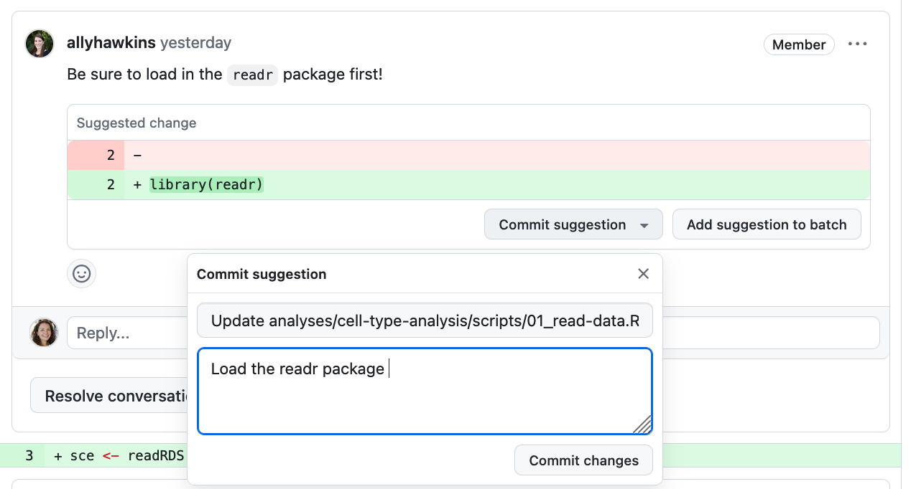
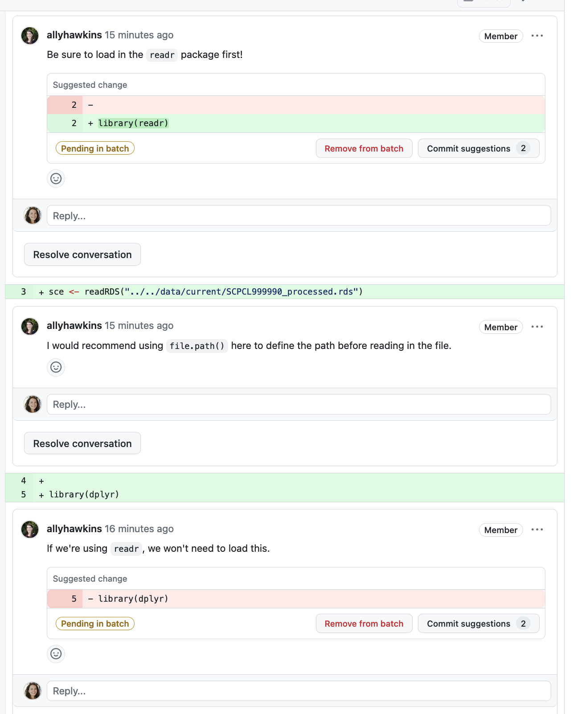

# Responding to code reviews

Code review is essentially a conversation between you and your reviewer about your proposed changes. 
This document includes some example review comments and guidance on how to respond to review comments and suggestions. 
To ensure that this process goes smoothly and with fewer opportunities for miscommunication, we strongly recommend reading through all of your reviewer's comments before diving into review:

- You'll gain more context about why the reviewer left certain comments by reading the whole review first.
    - Several comments may also be related to each other, and taking in the full review will help you identify similar concepts or areas the reviewer noted.
- It's also possible that your reviewer misunderstood, or differently interpreted, some changes you made.
    - Reading the full review will help you understand if there are areas that need clarification before you can dive into responding.

## Navigating the pull request page

On the top of the PR page, you will see four tabs:

<figure markdown="span">
    {width="800"}
</figure>

- **`Conversation`**
    - This tab shows the main page of the PR.
    Here, you can find the original description of the PR along with any comments left on the PR, both reviewer comments and any comments you leave in response.
    - You can also find any [resolved comments](https://docs.github.com/en/pull-requests/collaborating-with-pull-requests/reviewing-changes-in-pull-requests/commenting-on-a-pull-request#resolving-conversations) here, if you need to refer to them again.
- **`Commits`**
    - This tab shows a list of all commits added to the branch that is being reviewed.
    Your reviewer may use this page to explore changes in individual commits.

<!-- comment to force two grid columns -->

- **`Checks`**
    - This tab shows results from certain types of code checks that have been automatically set up by the Data Lab; you can ignore this tab.
- **`Files changed`**
    - This tab shows a line-by-line overview of content you have added and removed in your branch.
    Changes shown here should reflect the difference between files in your branch and the base branch your PR is targeting.
This should be the `main` branch of the `AlexsLemonade/OpenScPCA-analysis` repository.
    - Referring to this tab is a great way to quickly see all your changes, as well as respond to [reviewer suggestions or comments](#inline-comments).

## Responding to review comments

When making code changes in response to review, you need to make sure your local repository is staying in-sync with any changes made directly on GitHub.
Follow these steps when responding to review to avoid [merge conflicts](../creating-pull-requests/resolve-merge-conflicts.md):

1. Before making any code changes, _pull_ your branch from GitHub.
This will ensure you are up-to-date with any code changes made on GitHub, including committed review suggestions or updates from merging the upstream `main` branch into your pull request branch.
    <figure markdown="span">
        {width="600"}
    </figure>

1. Make changes, commit, and push as you normally would.
Any changes you push to the branch with an open PR will automatically be reflected in the PR.
    - When committing changes in response to review, the smaller the better!
    Review will go more smoothly if each commit addresses only one review comment.

## Re-requesting review

Once you feel that you have addressed your reviewer's comments, you can [re-request review by clicking the cycle icon next to their handle on the right side of the PR page](https://docs.github.com/en/pull-requests/collaborating-with-pull-requests/reviewing-changes-in-pull-requests/incorporating-feedback-in-your-pull-request#re-requesting-a-review).

<figure markdown="span">
    {width="400"}
</figure>

You can also post a comment in your PR summarizing your response to review, which will help your reviewer navigate your code changes:

- Which review comments did you address?
    - Is there more information you can tell your reviewer that will help them understand your code changes?
- Which review comments, if any, did you not address?
    - Was it because the review comment itself was confusing, or because you weren't sure how to address it?
    Communicating this with your reviewer will help you both out!

## Types of reviewer comments

When reviewing your pull request, there are several types of comments your reviewer may leave for you to respond to.
<!-- Please refer to [our documentation on example reviews](STUB_LINK example reviews). -->

!!! tip "Reading review comments"
    Unresolved file-level and inline review comments will appear both in the `Conversation` and in the `Files Changed` tabs.

    - In the `Conversation` tab, comments are listed in chronological order based on when the reviewer wrote the comment, which might not match the order of the code itself.
    - In the `Files Changed` tab, comments appear right at the file or line of code they are about.

### Comments with overall feedback

In most circumstances, your reviewer will leave an overall high-level comment explaining their overall impressions from reviewing the code and synthesizing the types of changes they are requesting you make.

### File-level comments

Your reviewer can leave file-specific comments that provide high-level feedback about the overall contents of a given file.

For example, this file-level review comment requests that the code author comment and document a script:

<figure markdown="span">
    {width="600"}
</figure>

### Inline comments

Your reviewer can also leave inline comments with feedback about specific lines of code:

<figure markdown="span">
    {width="600"}
</figure>

You can directly reply to these review comments on GitHub.
For example, you might ask your reviewer to clarify a particular comment, or ask for more guidance about how to implement the review.
Or, you might just want to leave your reviewer a helpful note of some kind!

The way to responding to an existing comment differs depending on which PR tab you are leaving the comment from:

- If you are in the **`Files changed`** tab, use the button `Add single comment` to reply (_do not use `Start a review`_):
    <figure markdown="span">
        {width="600"}
    </figure>

- If you are in the **`Conversation`** tab, use the button `Comment`.
    <figure markdown="span">
        {width="600"}
    </figure>

### Suggestion comments

Reviewer comments can also include _suggestions_ for code changes, that you can incorporate into your PR directly on GitHub.

For example, below are two suggestions left as comments on an R script:

- In the first comment, the reviewer suggested that the code author add a new line to load the `readr` library.
- In the second comment, the reviewer suggested that the code author remove a line that loads the `dplyr` library.

<figure markdown="span">
    {width="600"}
</figure>

Suggestion comments have two associated buttons boxed in the image above: `Commit suggestion` and `Add suggestion to batch`.

- You can directly commit a _single_ suggestion by clicking `Commit suggestion` button, and then clicking `Commit changes` in the dropdown box:
<figure markdown="span">
    {width="600"}
</figure>

- Alternatively, if there are multiple suggestions to accept, you can click the `Add suggestion to batch` button on each one.
_The `Add suggestion to batch` option is only available via the `Files changed` tab!_
    - Now, both suggestions are `Pending in batch` to be committed as a group:
<figure markdown="span">
    {width="600"}
</figure>

You can commit the batched suggestions at once with the `Commit suggestions` button that will appear at the top of the `Files changed` tab:

<figure markdown="span">
    {width="600"}
</figure>

Read this GitHub documentation for more about [applying suggested changes while responding to review](https://docs.github.com/en/pull-requests/collaborating-with-pull-requests/reviewing-changes-in-pull-requests/incorporating-feedback-in-your-pull-request).

