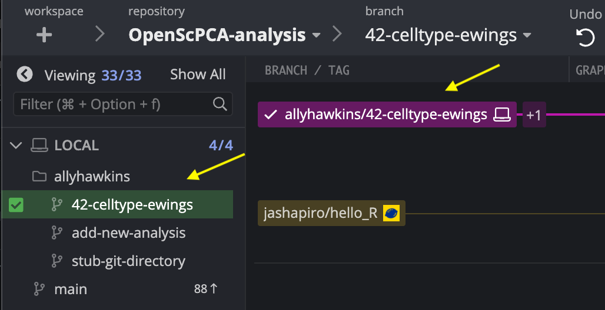
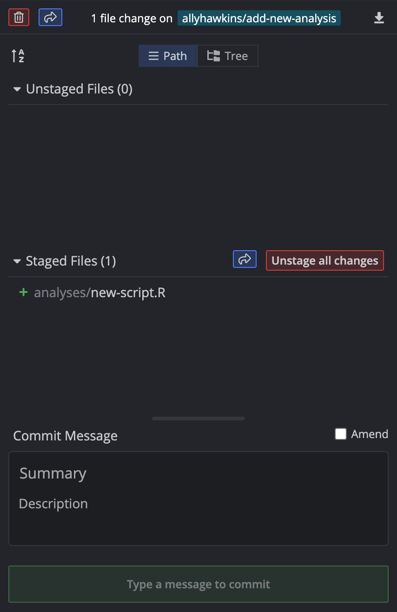
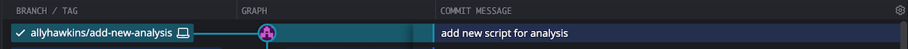

# Making commits

Once you have added or modified code for your analyses that you are happy with, you will need to commit your changes to your feature branch.
A Git commit ensures that the new file or changes to an existing file are saved under version control.
For each commit, a unique ID (also known as a hash) will be assigned to identify that commit, allowing you to easily track changes.

!!! note
    For more information on commits, see [GitHub's documentation on commits](https://docs.github.com/en/pull-requests/committing-changes-to-your-project/creating-and-editing-commits/about-commits) or this helpful [video describing commits with GitKraken](https://www.youtube.com/watch?v=XfDbGgSwa5I).

## How to make a commit

After making sure you have selected the correct feature branch, follow these steps to make a commit to your branch on GitKraken.

1. Hover over any files you wish to commit and select the `Stage File` button.
This will move that file from the `Unstaged Files` area to the `Staged Files` area.
Any files that are in the `Staged Files` section will be included in your commit.
If you wish to include all changes to all files, use the `Stage all changes` button.

<figure markdown="span">
    {width="600"}
</figure>

2. Write a commit message by filling in the `Summary` box.
This should be a short message that describes what changes are being made with that commit.

<figure markdown="span">
    {width="450"}
</figure>

3. Click on `Stage files/changes to commit` to make the commit.
This action ensures that your commit, and any changes associated with that commit, is saved to your branch.
You should now see a new line with your commit message connected to your branch name in GitKraken.

<figure markdown="span">
    {width="600"}
</figure>

You have now successfully committed your changes to your feature branch!
