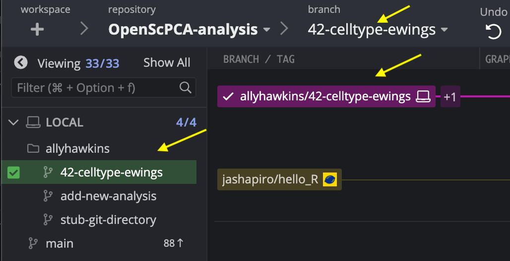
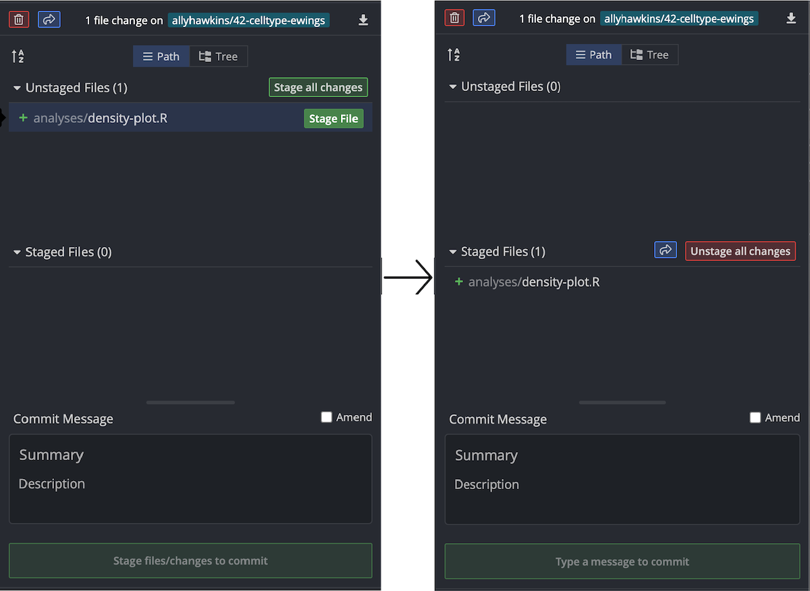
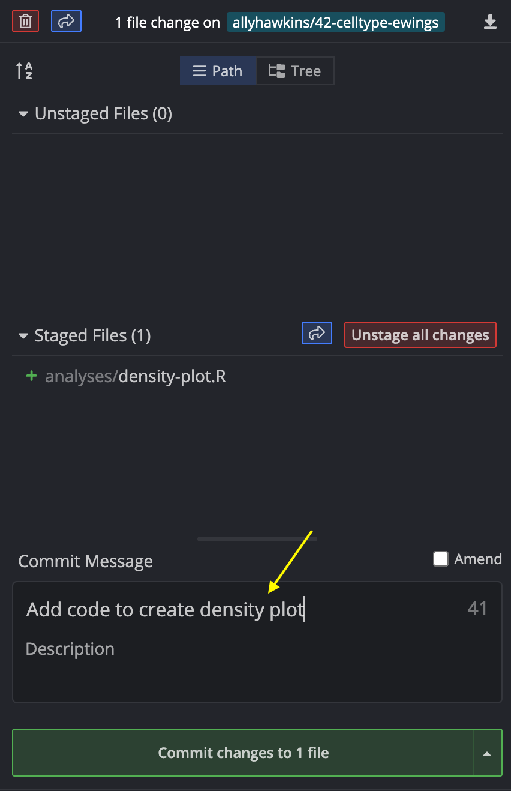
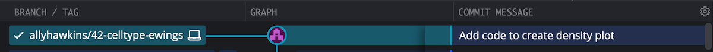

# Making commits

Once you have added or modified code for your analyses that you are happy with, you will need to commit your changes to your feature branch.
A Git commit saves your code changes to version control.
For each commit, a unique ID (also known as a hash) will be assigned to identify that commit, allowing you to easily track changes.

!!! note
    For more information on commits, see:

    - [GitHub's documentation on commits](https://docs.github.com/en/pull-requests/committing-changes-to-your-project/creating-and-editing-commits/about-commits)
    - [A video describing commits with GitKraken](https://www.youtube.com/watch?v=XfDbGgSwa5I).

## How to make a commit in GitKraken

### Step 1: Make sure you are in the right branch

Before making your commit, be sure you are working in the correct feature branch.
In GitKraken, you will see a check mark next to the branch name you have checked out in both the side menu under `Local` and in the branch diagram.

<figure markdown="span">
    {width="600"}
</figure>

For more on branches see [Working with branches](./working-with-branches.md).

### Step 2: Stage your changed files

- Hover over any files you wish to commit and select the `Stage File` button.
This will move that file from the `Unstaged Files` area to the `Staged Files` area.
- Any files that are in the `Staged Files` section will be included in your commit.
- Only select files that you wish to be included in this commit!
Each commit should correspond to a single change or group of related changes.
For example, when updating both code and documentation, commit your code changes and your documentation changes separately.
- If you wish to include all changes to all files, use the `Stage all changes` button.

<figure markdown="span">
    {width="600"}
</figure>

### Step 3: Add a commit message

Write a commit message by filling in the `Summary` box.
This should be a short message that describes what changes are associated with that commit.
For example, when adding code to create a new plot, write "Add code to create density plot".

<figure markdown="span">
    {width="450"}
</figure>

### Step 4: Make the commit

Click on `Stage files/changes to commit` to make the commit.
This action ensures the code changes in your commit are saved in your branch's history.
You should now see a new line with your commit message connected to your branch name in GitKraken.

<figure markdown="span">
    {width="600"}
</figure>

#### Pre-commit

- Every time you make a commit, you will see a banner showing the status of pre-commit.
- Files will not be committed, unless pre-commit has passed.
    - Still need to set up pre-commit?
    See [Install pre-commit and setup hooks](STUB-LINK).

<figure markdown="span">
    {width="600"}
</figure>

If you are making your first commit, the pre-commit checks may take longer and you will see the following banner:

<figure markdown="span">
    {width="600"}
</figure>

Having trouble getting pre-commit to pass?
See [Troubleshooting commit fails](STUB-LINK).

You have now successfully committed your changes to your feature branch!
