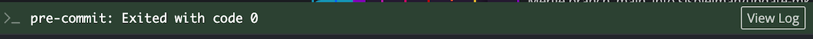

# Making commits

Once you have added or modified code for your analyses that you are happy with, you will need to commit your changes to your feature branch.
A Git commit saves your code changes to version control.
For each commit, a unique ID (also known as a hash) will be assigned to identify that commit, allowing you to easily track changes.

!!! note "Learn more about commits"

    - [GitHub's documentation on commits](https://docs.github.com/en/pull-requests/committing-changes-to-your-project/creating-and-editing-commits/about-commits)
    - [A video describing commits with GitKraken](https://www.youtube.com/watch?v=XfDbGgSwa5I)

## How to make a commit in GitKraken

### Step 1: Make sure you are in the right branch

Before making your commit, be sure you are working in the correct [feature branch](./working-with-branches.md).
In GitKraken, you will see a check mark next to the branch name in both the side menu under `Local` and in the branch diagram.
The checkmark next to the branch name indicates that you have that branch checked out.

<figure markdown="span">
    {width="600"}
</figure>

For more on branches see [Working with branches](./working-with-branches.md).

### Step 2: Stage your changed files

- On the right-hand panel, you will see a list of files that you have modified under `Unstaged Files`.
    - These are changes which you could include in your commit.
- Choose the changes you want to include in your commit and move them from the `Unstaged Files` area to the `Staged Files` area:
    - To include all changes, click the `Stage all changes` button.
    - To include only some changes, hover over individual files and click the `Stage File` button one at a time.
    This will move that file from the `Unstaged Files` area to the `Staged Files` area.
    - ⚠️ Any files that you move into the `Staged Files` section will be included in your commit.

Each commit should correspond to a single change or group of related changes.
For example, if you are updating both code and documentation, commit your code changes and your documentation changes separately.

<figure markdown="span">
    {width="600"}
</figure>

### Step 3: Add a commit message

Write a commit message by filling in the `Summary` box.
This should be a short message that describes what changes are associated with that commit.

For example, if you are adding code to create a new plot, you could write, "Add code to create density plot".

<figure markdown="span">
    {width="450"}
</figure>

### Step 4: Make the commit

Click on `Stage files/changes to commit` to make the commit.
This action ensures the code changes in your commit are saved in your branch's history.
You should now see a new line with your commit message connected to your branch name in GitKraken.

<figure markdown="span">
    {width="600"}
</figure>

#### Pre-commit checks

- Every time you make a commit, you will see a banner showing the status of [the pre-commit checks](STUB_LINK for precommit).
- Files will only be committed if the pre-commit checks pass.
    - Still need to set up pre-commit in the repository?
    See [Install pre-commit and setup hooks](STUB-LINK).

<figure markdown="span">
    {width="600"}
</figure>

If you are making your first commit, the pre-commit checks may take longer and you will see the following banner:

<figure markdown="span">
    {width="600"}
</figure>

Having trouble getting pre-commit checks to pass?
Please see the [documentation for troubleshooting commit failures](STUB-LINK).

You have now successfully committed your changes to your feature branch!
