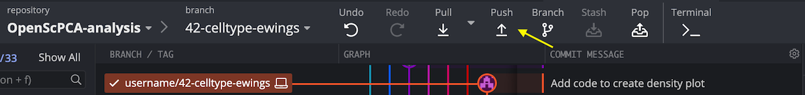
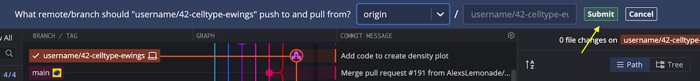
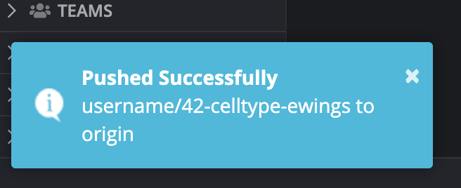
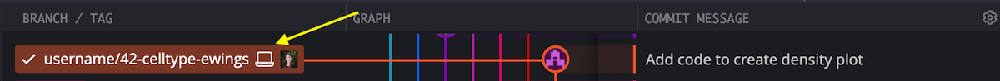

# Pushing to origin

Pushing commits from your local branch to origin creates a remote copy of the changes on your local branch in your repository.
In this case, you will push to a remote branch to your fork of `OpenScPCA-analysis`.
This means your changes are now present both locally on your computer and on GitHub.

!!! note "Learn about pushing to origin"

    - [Pushing commits to a remote repository](https://docs.github.com/en/get-started/using-git/pushing-commits-to-a-remote-repository)
    - [Pushing to origin with GitKraken](https://www.gitkraken.com/learn/git/problems/git-push-to-remote-branch)

## Why push?

- Pushing your changes will allow to to eventually [file a pull request](../creating-pull-requests/index.md) to the `main` branch of `OpenScPCA-analysis`.
    - Filing a pull request is the only way to incorporate your changes into the main code base of OpenScPCA.
- This allows you to work on your branch on multiple computers.
    - Once you push to origin, your changes can then be pulled from the remote repository to any computer (such as working with Amazon Lightsail for Research).

## How to push to origin with GitKraken

1. Make sure all changes you would like to include have been committed; see the section on [making commits](./making-commits.md) for more information.

1. Select `Push`, located above the branch diagram in `GitKraken`.

    <figure markdown="span">
        {width="600"}
    </figure>

    The first time that you push to origin for a feature branch, you will be prompted to select the remote branch to push to and from.

    - The first box should say `origin`, telling GitKraken to push your changes to a branch to your remote fork of `OpenScPCA-analysis`.
    - The second box tells GitKraken what to name the remote copy of the branch.
        - This field will be automatically populated with the same name used for the local branch.
        - We recommend you keep this default and use the same branch name for the local and remote branch.
    - Press `Submit` to confirm your choices and push to origin.

    <figure markdown="span">
        {width="600"}
    </figure>

1. Confirm that you now have a remote copy of your feature branch.

    After you push to origin, you will see a message pop-up in the lower left stating, `Pushed successfully`.

    <figure markdown="span">
        {width="400"}
    </figure>

    You will also be able to see both the local computer icon and your GitHub avatar next to your branch name, indicating that your local branch and remote branch  are now in sync.

    <figure markdown="span">
        {width="600"}
    </figure>

1. If/when you make more changes, commit those changes, and then select `Push` to push to origin.

    Because you have already set the remote branch, changes will automatically be pushed to that remote branch using the `Push` button, with no further prompts from GitKraken.

    Congratulations, you have now synced your local changes with a remote branch!

## When to push

Note that you do not need to push to origin for every commit that you make.
Any local commits that are not present in the remote branch will be included when you push to origin.

We recommend pushing any commits you have made at the completion of a coding session.

For example, if you commit changes to code and documentation separately, push both those commits together.
