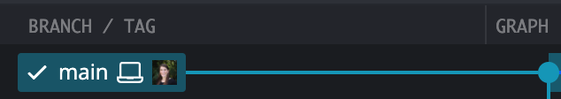
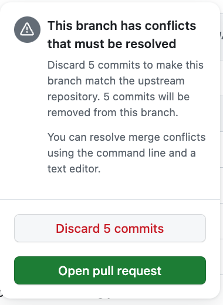
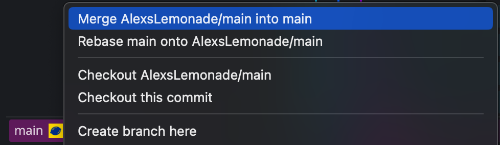

# Staying in sync with the upstream repository

You may wish to keep changes made in `AlexsLemonade/OpenScPCA-analysis` in sync with the `main` branch of your fork.
This ensures that your fork has the most recent changes and updates found in the main code base.

!!! note "Learn about syncing your fork"

    For more information on syncing your fork with the upstream repository, see the [GitHub documentation on syncing a fork](https://docs.github.com/en/pull-requests/collaborating-with-pull-requests/working-with-forks/syncing-a-fork).

## How to sync your fork with changes in `AlexsLemonade/OpenScPCA-analysis`

Follow these steps to keep your fork in sync with changes in `AlexsLemonade/OpenScPCA-analysis`:

1. Login to GitHub and navigate to the homepage of your forked repository (https://github.com/YOUR_USERNAME/OpenScPCA-analysis).

1. If the `main` branch of your fork is out of date with the `main` branch of `AlexsLemonade/OpenScPCA-analysis`, then you will see a note that states, "This branch is X commits behind `AlexsLemonade/Open-ScPca-analysis:main`".

    You can then press `Sync fork` to sync your fork with any upstream changes.

    <figure markdown="span">
        {width="600"}
    </figure>

1. After pressing `Sync fork` a pop-up will notify you that the branch is out-of-date.
    Go ahead and press `Update branch`.

    <figure markdown="span">
        {width="300"}
    </figure>

1. If your `main` branch has been updated successfully, you will now see a note that the branch is up to date with `AlexsLemonade/OpenScPCA-analysis`.

    <figure markdown="span">
        {width="600"}
    </figure>

## Resolving sync conflicts

If there are changes on your `main` branch that conflict with the current code in the `main` branch of `AlexsLemonade/OpenScPCA-analysis`, you will not be able to sync until those conflicts have been resolved.

When this happens, GitHub will notify you that there are conflicts after pushing `Sync fork`.

<figure markdown="span">
    {width="300"}
</figure>

**Do not click either of the buttons `Discard X commits` or `Open pull request`.**
Instead, follow these steps to fix the sync conflicts in GitKraken:

1. Open up your forked repository in GitKraken and checkout the `main` branch of your fork.

1. Repeat the attempt to sync your changes with the upstream branch.
    To do this, right-click on the remote `main` from `AlexsLemonade/OpenScPCA-analysis` and select `merge AlexsLemonade/main into main`.

    <figure markdown="span">
        {width="600"}
    </figure>

1. A banner will pop up indicating that there is a merge conflict.
Any files that contain conflicts will be listed on the right-hand side under `Conflicted files`.

    <figure markdown="span">
        {width="600"}
    </figure>

    <figure markdown="span">
        {width="600"}
    </figure>

    To learn how to resolve these conflicts, please watch this [tutorial from GitKraken](https://www.gitkraken.com/learn/git/tutorials/how-to-resolve-merge-conflict-in-git).

    Once you have resolved the conflicts and committed the changes, your `main` branch will now be in sync with the upstream `main` branch of `AlexsLemonade/OpenScPCA-analysis`.
