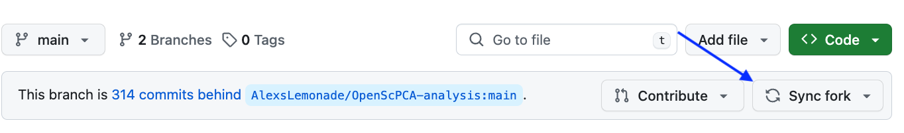
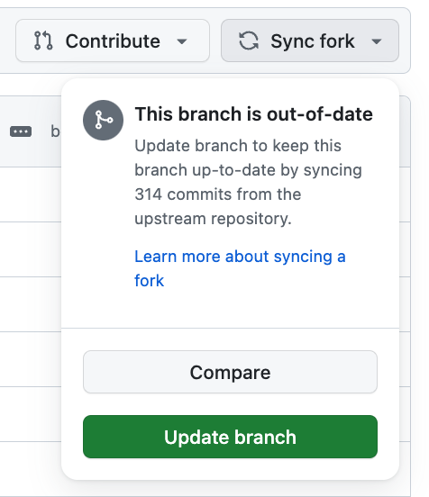
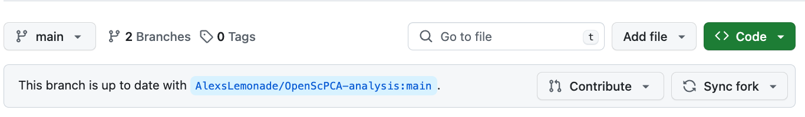
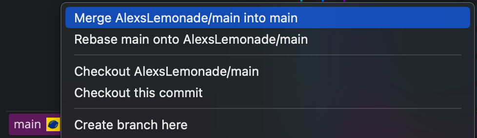
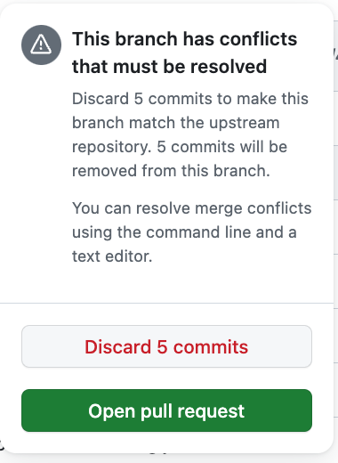
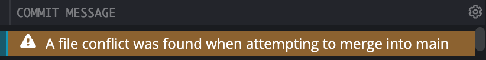
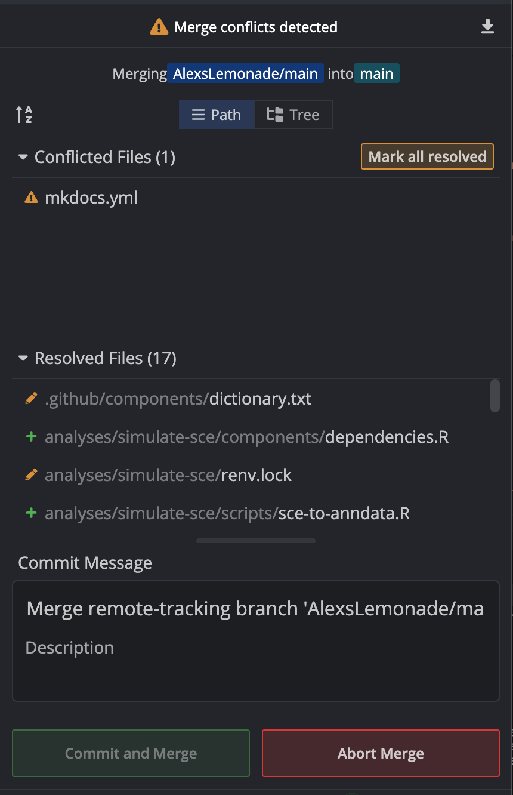

# Staying in sync with the upstream repository

You may wish to keep changes made in `AlexsLemonade/OpenScPCA-analysis` in sync with the `main` branch of your fork.
This ensures that your fork has the most recent changes and updates found in the main code base.

We recommend syncing at the following times:

- Before you make a [new feature branch](./working-with-branches.md) off `AlexsLemonade/OpenScPCA-analysis:main`
- Before [filing a pull request](../creating-pull-requests/index.md) to merge your feature branch into `AlexsLemonade/OpenScPCA-analysis:main`
- After you have merged a pull request into `AlexsLemonade/OpenScPCA-analysis:main` <!-- STUB_LINK: link to merge docs-->

!!! note "Learn about syncing your fork"

    For more information on syncing your fork with the upstream repository, see the [GitHub documentation on syncing a fork](https://docs.github.com/en/pull-requests/collaborating-with-pull-requests/working-with-forks/syncing-a-fork).

## Syncing your fork with `AlexsLemonade/OpenScPCA-analysis`

Follow these steps to keep your fork in sync with changes in `AlexsLemonade/OpenScPCA-analysis`:

1. Login to GitHub and navigate to the homepage of your forked repository (`https://github.com/YOUR_USERNAME/OpenScPCA-analysis`).

1. If the `main` branch of your fork is out of date with the `main` branch of `AlexsLemonade/OpenScPCA-analysis`, then you will see a note that states:

    >  This branch is X commits behind `AlexsLemonade/OpenScPCA-analysis:main`.

    You can then press `Sync fork` to sync your fork with any upstream changes.

    <figure markdown="span">
        {width="600"}
    </figure>

2. After pressing `Sync fork`, GitHub will notify you that the branch is out-of-date.
Go ahead and press `Update branch`.

    - If GitHub instead tells you there are conflict that must be resolved, see the [section below on resolving sync conflicts](#syncing-your-fork-when-there-are-sync-conflicts).

    <figure markdown="span">
        {width="300"}
    </figure>

3. If your `main` branch has been updated successfully, you will now see a note that the branch is up to date with `AlexsLemonade/OpenScPCA-analysis`.

    <figure markdown="span">
        {width="600"}
    </figure>

4. Before making any changes locally, you will need to pull the synced changes from GitHub to your computer.

    In GitKraken, you will see two versions of the `main` branch in the branch graph:

       - One will contain a computer icon.
        This is the copy of the branch on your local computer.

       - The other will contain your GitHub avatar.
        This is the copy of the branch on GitHub.

    Double-click on the remote `main` (GitHub avatar) and GitKraken will notify you that a local `main` already exists.
    Click the button that says `Reset Local to Here`.

    <figure markdown="span">
        {width="600"}
    </figure>

    You now should see that your local and remote copy of `main` are synced with both avatars next to the branch name.

    <figure markdown="span">
        {width="600"}
    </figure>

## Syncing your fork when there are sync conflicts

If there are changes on your `main` branch that conflict with the current code in the `main` branch of `AlexsLemonade/OpenScPCA-analysis`, you will not be able to sync until those conflicts have been resolved.

When this happens, GitHub will notify you that there are conflicts after pushing `Sync fork`.
**Do not click either of the buttons `Discard X commits` or `Open pull request`.**

<figure markdown="span">
    {width="300"}
</figure>

Instead, follow these steps to fix the sync conflicts in GitKraken:

!!! tip
    Learn more about how to resolve these conflicts by watching this [tutorial from GitKraken](https://www.gitkraken.com/learn/git/tutorials/how-to-resolve-merge-conflict-in-git).

1. Open up your forked repository in GitKraken and checkout the `main` branch of your fork.

1. Repeat the attempt to sync your changes with the upstream branch.
    To do this, right-click on the remote `main` from `AlexsLemonade/OpenScPCA-analysis` and select `merge AlexsLemonade/main into main`.

    <figure markdown="span">
        {width="600"}
    </figure>

1. A banner will pop up indicating that there is a merge conflict.
Any files that contain conflicts will be listed on the right-hand side under `Conflicted files`.

    <figure markdown="span">
        {width="400"}
    </figure>

    <figure markdown="span">
        {width="400"}
    </figure>

    Once you have resolved the conflicts and committed the changes, your `main` branch will now be in sync with the upstream `main` branch of `AlexsLemonade/OpenScPCA-analysis`.

    We also suggest [pushing these changes to GitHub](./push-to-origin.md), to ensure that both the local and remote copy of your fork's `main` branch are in sync with `AlexsLemonade/OpenScPCA-analysis:main`.
