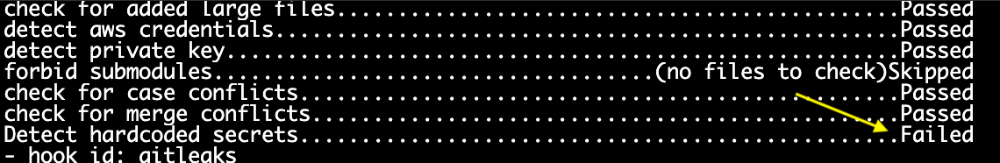
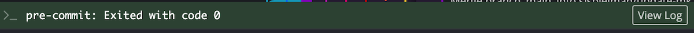

# Troubleshooting commits

On this page we cover some commonly occuring scenarios that may cause you're commit to fail.

## Why is pre-commit failing?

We ask that all contributors set up pre-commit hooks prior to making any commits.
For more information see the [documentation provided on setting up pre-commit](../../technical-setup/setup-precommit.md).

We have set up pre-commit hooks to manage basic code security and catch other common problems, such as:

- Large data files that should not be committed to the repository (files > 200 Kb)
- Merge conflicts that have not yet been resolved
    - If you need help resolving merge conflicts, please see [resolving merge conflicts](STUB-LINK for merge conflicts).
- Credential files and other sensitive information

If you attempt to commit anything in the above list, then you will see a red banner indicating pre-commit failed.
If this is the case, you will not be able to commit your changes until you fix the conflict.

You can click the `View log` button on the right hand side of the pre-commit banner to see which checks failed.

<figure markdown="span">
    {width="600"}
</figure>

In the below example, the pre-commit failure is because we are trying to commit a file that contains credentials.

<figure markdown="span">
    {width="600"}
</figure>

The log may also include some details on which file caused an error and the reason.
Typically, this will require you to delete sensitive information or remove any large files.

Once you have identified and resolved the issue, you will need to re-add your files to the `Staged files` section.
Then you can commit your files and pre-commit should now pass.

<figure markdown="span">
    {width="600"}
</figure>

## Why doesn't the file I added show up in GitKraken for me to stage and commit?

In some cases, you may try to commit a file that does not show up in the `Unstaged files` section of GitKraken.
If the file is not there, than you cannot stage it and make a commit.

We have set up a [`.gitignore` file](https://docs.github.com/en/get-started/getting-started-with-git/ignoring-files) in the root directory of this repository that will tell Git to ignore certain files.
Any files with a matching extension or path listed in the `.gitignore` will not be allowed to be committed to the repository.

Ignored files include the following:

- Data files, such as `.rds` or `.hdf5` files
- Environment files, such as `renv` and `env` directories
- Other hidden files produced by R and Python
