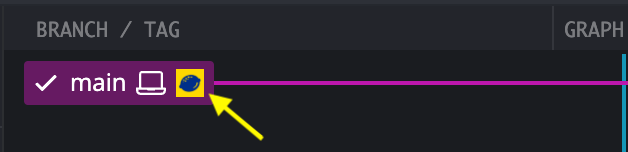
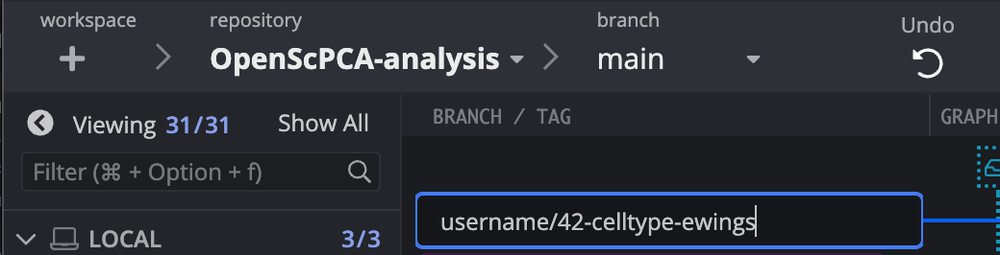

# Working with branches

## What is a branch?

A branch in GitHub refers to an isolated copy of the repository contents.
For example, the `main` branch of the `OpenScPCA-analysis` repository contains the main copy of all items in the repository.

!!! note
    For more details on branches, see [GitHub's documentation describing branches](https://docs.github.com/en/pull-requests/collaborating-with-pull-requests/proposing-changes-to-your-work-with-pull-requests/about-branches) and [this tutorial on creating branches with GitKraken](https://www.gitkraken.com/learn/git/problems/create-git-branch).

## What is a feature branch?

Instead of directly making code changes in the `main` branch, we write code in a _feature branch_ created off of the `main` branch.
A feature branch contains a copy of in an isolated space.
By using feature branch, you can make code changes without affecting the code in the `main` branch or interfering with other contributors as they make changes.

## When should you use a feature branch?

Every time you make a new addition or modify existing code, you will want to create a _new_ feature branch.
Every pull request should contain changes made in a _single_ feature branch.

## Overview of working with branches in OpenScPCA

- When you are working on your own analyses or proposing a change to the main code base, we ask that you first fork the repository and then create a feature branch from the `main` branch of your fork.
    - Haven't forked yet? Please see [Forking the repo](STUB-LINK).
- You should then incorporate or add any changes that you make to that feature branch (see [Making commits](STUB-LINK)).
- Then create and file a pull request to the `main` branch of `OpenScPCA-analysis` to request to incorporate your additions into the main code base (see [Creating pull requests](STUB-LINK)).

## Creating a feature branch in GitKraken

Follow these steps to create your feature branch:

1.Open the GitKraken GUI interface and make sure you are on the `main` branch of your fork of `OpenScPCA-analysis`.
You can do this by checking the `main` box listed under the `Local` menu.

<figure markdown="span">
    {width="600"}
</figure>

2.Create and checkout a new branch by right-clicking on the `main` branch and selecting `Create branch here`.

<figure markdown="span">
    {width="600"}
</figure>

3.You will then be prompted to name your branch.
We encourage users to name their branch using their GitHub username followed by a description of what changes will be included in the branch.
For example, if you are adding an analysis to add cell type annotations to Ewing sarcoma samples, you might name your branch `username/celltype-ewings`.

<figure markdown="span">
    {width="600"}
</figure>

!!! note
    Pro tips for creating branch names:

    - Branch names should always be unique, so don't reuse old branch names!
    - Names should not contain any special symbols besides `_` and `-`.
    - It can be extra helpful to include the issue number in your branch name, e.g., `username/42-celltype-ewings`.

You have now successfully created a new branch and are free to make changes to the code and continue with your analysis!
