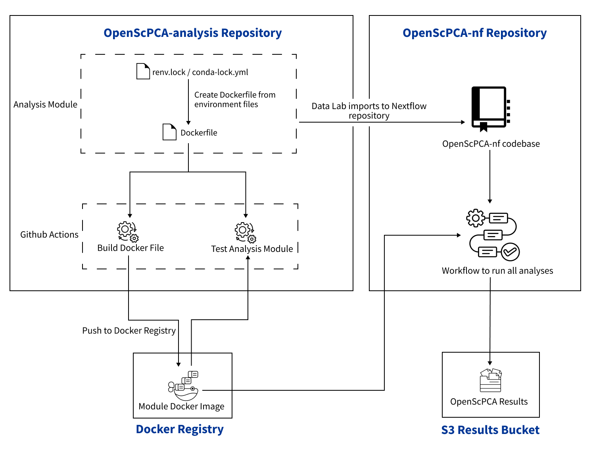

# Ensuring reproducibility

A key goal of the OpenScPCA project is to ensure that results remain reproducible over time.
This section describes steps that we take to achieve this goal and ensure a stable codebase, illustrated by the figure below:

<figure markdown="span">
    {width="700"}
</figure>

- We require each analysis module to have [its own software environment](./managing-software/index.md) with pinned dependencies
    - As analysis modules mature, these software dependencies will be added to a [module-specific Docker image](./docker/docker-images.md)
- We use the [GitHub Actions](https://docs.github.com/en/actions) continuous integration framework to [automate certain processes that ensure reproducibility](./workflows/index.md), including:
    - [Testing](./workflows/run-module-gha.md) that analysis modules run to completion without errors
    - [Building module-specific Docker images](./workflows/build-docker-gha.md) and pushing them to a public registry for broad reuse
- We maintain a separate repository, [`OpenScPCA-nf`](./openscpca-nf/index.md), where completed analysis modules are run in a reproducible [Nextflow workflow](https://www.nextflow.io/) to generate workflow results associated with OpenScPCA data releases
