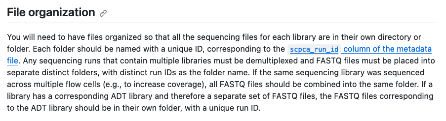
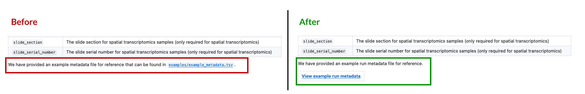
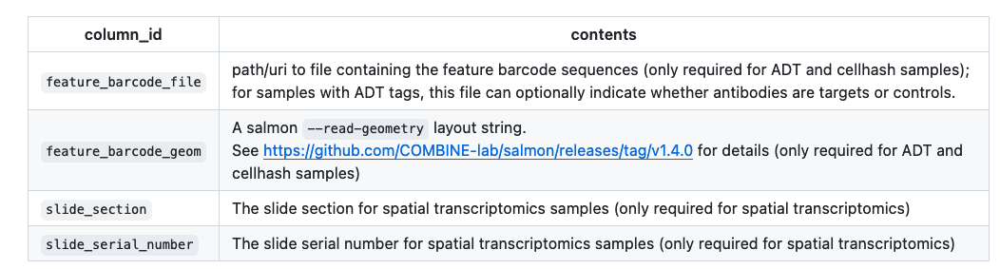
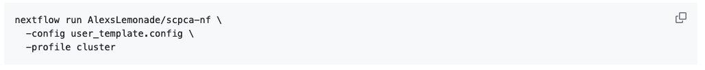

The aim of this guide is to provide some instructions on how to consistently write easy to absorb documentation.
The guide will focus on the following to achieve this:

- [Structure](#structure)
- [Language](#language)
- [Tone](#tone)

# Structure

## Titling sections

People scan in an `F` pattern.
We can leverage and place the most valuable information in the their scanning path to ensure that they at least get an overview of the contents while scanning.
We can do that by:
 - **Clear hierarchy between titles and content text**
    Ensure that section titles have a noticeably larger font-size than the content.
    Use markdown headings to create an hierarchy throughout the document.

 - **Keep section titles short and concise**

 - **Subject first for informational sections**
    Sections describing special considerations can put the subject first like `Multiplexed (cellhash) libraries`

- **Action first for instructive sections**
    When titling sections based on steps users need to take to setup/ troubleshoot, put what action they are expected to take first, like downloading, or configuring.
    Example: `Configure the metadata file`

## Organizing the information

Provide generalized information first, and then describe the special use cases.

The same rule applies in instructive documentation too.
Provide information for using the tool with default settings, then the optional configurations and special cases.

When writing instructive documentation, tuck away the details like advanced configurations in a different page.

The example below describes the target file organization, presenting the general case first and then presenting how to organize files for specific cases.

   

## Using lists

Use bullets to emphasize information and make it easier to scan.

Use it for describing:
- Requirements
- Steps for setting up
- Features
- Lists of inputs or output files

## Using buttons

Use [Github buttons](https://gist.github.com/apaskulin/1ad686e42c7165cb9c22f9fe1e389558#buttons) to draw attention to important links.
Use buttons sparingly.

Use the buttons for links critical for users to continue on to the next stage like:
- Detailed instructions from an overview page.
- Examples files and data

In the example below, presenting the link to the example metadata file as a button makes it easier for the user to find the link.

   

## Using tables

Use tables to describe
- Variables
- Parameters
- Metadata columns.

## Using code blocks

Use code blocks for commands and snippets that users can copy and reuse for themselves.

## Use visual aids

Use illustrations to quickly summarize concepts, processes, and pipelines.

Use screenshots to help explain how users need to navigate complex interfaces.

# Language

We can write documentation which is easy to understand by incorporating the below principles:

## Active voice and present tense

The use of an active and present tense will make the documentation direct and simple.
Active voice makes it clear who is taking which action.
Present tense gives the sentences an assertive feel.
This is especially important when writing instructions.

## Use the simplest form of the word

Use everyday language as much as possible.

Try to use the simplest synonym when possible.

For example, instead of `utilize`, say `use`.

## Short sentences

Shorter sentences help breakdown complex ideas into bite-sized chunks which help users absorb information better.

## Short Paragraphs

Shorter paragraphs allow users to take a pause between different ideas.
In addition, shorter paragraphs are also easier to scan.

You can make paragraphs shorter by:
- Ensuring that each paragraph conveys only one idea or thought.
- Breaking up large paragraphs into sub-sections, lists, or bullets so they are easier to scan.

## Avoid using jargon

Jargon is unavoidable but try to use terms that our audience will know.
For example, using `PRs`, `runs` is acceptable (and necessary).
Avoid using jargon outside of our audience's wheelhouse like `deploy`.

In cases where using an unfamiliar term is unavoidable, add an additional sentence briefly explaining what it means in this context.
If the concept is complex, link out users to learn more about it.

### How to refer to users, ourselves, and others

- Use `we`, or `us` to refer to the Data Lab
- Use `you` to refer to the user reading the doc
- Use `other contributors` to refer to the group of users besides the user reading the doc

Examples:
- We have provided an example analysis notebook.
You will need to make a copy the example notebook and create your analysis.

- After you file a PR, it will be reviewed by us or other contributors to the project.

# Tone

## Instructive

We must ensure that our instructions are clear about what the user is expected to do vs what will done for them by the Data Lab or other contributors.

It is especially important to use active voice and present tense when writing instructions.

Here are some tips to ensure clear and easy-to-understand instructions:

### I did it one way

Choose the most easy-to-follow way to do the task and provide instructions for that method.

Avoid showing users multiple ways to do a task.
It will only confuse them.

Don't show how power users might complete the task, even if that is easier.

For example, if the user can set configurations either with a file or with a command, choose one method and provide instructions only for that.

### Handling special cases

When describing exceptions, be clear about the case and what actions users need to take for that case.

Avoid things like 'Depending on the functions, you can do Y."

Instead say, "When you use function X, do Y and when you use function A, do B."

### Everyone loves a good example

Examples are a good way to solidify your instructions.

Instead of just describing a configuration file, providing an example file will enhance users' understanding of the fields and how they are expected to be structured.
It will also give them file they can re-use when trying to do the task on their own.

Here are some examples you provide:

- Example configuration files
- Example commands
- Example metadata files
- Example data
