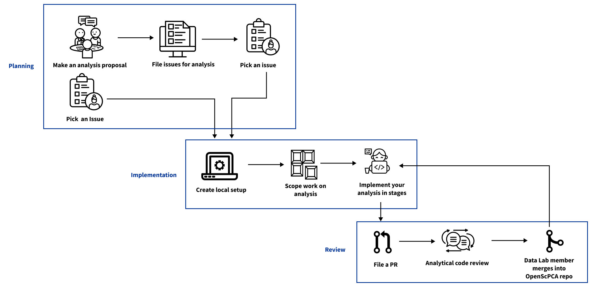

# Making your first analysis contribution

This is the path that you can expect to follow when making your first contribution to an analysis. 

* [Planning](#planning)
* [Implementation](#implementation)
* [Review](#review)

## Planning

### Make an analysis proposal 

[Start with GitHub Discussions](https://github.com/AlexsLemonade/OpenScPCA-analysis/discussions/111) to propose a new analysis or a modification to an existing analysis.

You will file a Discussion for:

* A new analysis in the [`Propose a new analysis` category](https://github.com/AlexsLemonade/OpenScPCA-analysis/discussions/categories/propose-a-new-analysis)
* An update to an existing analysis in the [`Modify an existing analysis` category](https://github.com/AlexsLemonade/OpenScPCA-analysis/discussions/categories/modify-an-existing-analysis)

A Data Lab member will review your proposal and respond to your original post to discuss further.
Together you will continue to develop your analysis plans and make decisions about next steps. 

### File an Issue

* After you have proposed an analysis on Discussions and a plan has been developed, then you can file [an Issue](https://github.com/AlexsLemonade/OpenScPCA-analysis/blob/main/docs/communications-tools/github-issues/index.md) in the `AlexsLemonade/OpenScPCA-analysis` repository.
* Refer to the documentation on [how to write an Issue](https://github.com/AlexsLemonade/OpenScPCA-analysis/blob/main/docs/communications-tools/github-issues/writing-issues.md). 
* We use [Issue templates](https://github.com/AlexsLemonade/OpenScPCA-analysis/blob/main/docs/communications-tools/github-issues/issue-templates.md) to prompt Issue authors to [include helpful information](relative link based on mkdocs, TBD) that helps us accomplish the work tracked in that Issue.

### Pick an existing Issue 

* There may be existing Issues in the `AlexsLemonade/OpenScPCA-analysis` repository for planned analyses that have not been started yet.
* If you would like to take on a planned analysis, you can comment on the Issue to note your interest, ask any clarifying questions, and/or propose a solution for the Data Lab team to review and discuss further.

## Implementation

### Create local setup 

Before starting your analysis, you will need to [set up your local environment](https://github.com/AlexsLemonade/OpenScPCA-analysis/blob/main/docs/technical-setup/index.md).

* Download and set up a [Git client](https://github.com/AlexsLemonade/OpenScPCA-analysis/blob/main/docs/technical-setup/install-a-git-client.md)
* [Fork the `AlexsLemonade/OpenScPCA-analysis` repository](https://github.com/AlexsLemonade/OpenScPCA-analysis/blob/main/docs/technical-setup/fork-the-repo.md)
* [Clone your fork](https://github.com/AlexsLemonade/OpenScPCA-analysis/blob/main/docs/technical-setup/clone-the-repo.md) to your computer
* Set up [additional dependencies](https://github.com/AlexsLemonade/OpenScPCA-analysis/blob/main/docs/technical-setup/environment-setup/index.md) on your computer that you'll need to contribute to OpenScPCA

The Data Lab will also create a user account for you on Amazon Web Services (AWS).
You will receive an email to complete setting up your account.

### Scope work  

* When working on an analysis, it's important to take some time to plan your work. 
* Refer to this documentation on [scoping your first pull request](https://github.com/AlexsLemonade/OpenScPCA-analysis/blob/main/docs/contributing-to-analyses/creating-pull-requests/scoping-pull-requests.md).

### Implement your analysis 

* Now that you have set up your local environment, discussed your proposed analysis, and filed an Issue, you're ready to create an [analysis module](https://github.com/AlexsLemonade/OpenScPCA-analysis/blob/main/docs/contributing-to-analyses/analysis-modules/index.md).

* Refer to the documentation on [creating an analysis module](https://github.com/AlexsLemonade/OpenScPCA-analysis/blob/main/docs/contributing-to-analyses/analysis-modules/creating-a-module.md) to make your first analysis folder.

* [Document each step of your analysis](https://github.com/AlexsLemonade/OpenScPCA-analysis/blob/main/docs/contributing-to-analyses/analysis-modules/documenting-analysis.md). 

* Once you have added or modified code for your analyses that you are happy with, you will need to [commit your changes](https://github.com/AlexsLemonade/OpenScPCA-analysis/blob/main/docs/contributing-to-analyses/working-with-git/making-commits.md) to your [feature branch](https://github.com/AlexsLemonade/OpenScPCA-analysis/blob/main/docs/contributing-to-analyses/working-with-git/working-with-branches.md).

## Review

### File a pull request

* Once you have committed changes to your feature branch and [pushed to origin](https://github.com/AlexsLemonade/OpenScPCA-analysis/blob/main/docs/contributing-to-analyses/working-with-git/push-to-origin.md), you are ready to file a [pull request](https://github.com/AlexsLemonade/OpenScPCA-analysis/blob/main/docs/contributing-to-analyses/creating-pull-requests/index.md).

* Refer to the documentation on [how to file a pull request](https://github.com/AlexsLemonade/OpenScPCA-analysis/blob/main/docs/contributing-to-analyses/working-with-git/push-to-origin.md). 

* Similar to Issue templates, we use [pull request templates](https://github.com/AlexsLemonade/OpenScPCA-analysis/blob/main/docs/contributing-to-analyses/creating-pull-requests/pull-request-template.md) to prompt you for information that will help us review your code.

### Undergo analytical code review

* [Pull requests must be reviewed and approved](https://github.com/AlexsLemonade/OpenScPCA-analysis/blob/main/docs/contributing-to-analyses/creating-pull-requests/index.md#the-pull-request-review-process) by a Data Lab member before they can be merged into the `AlexsLemonade/OpenScPCA-analysis` repository.
* All pull requests will undergo [analytical code review](https://github.com/AlexsLemonade/OpenScPCA-analysis/blob/main/docs/contributing-to-analyses/pr-review-and-merge/index.md). 

### Merge

* Once approved, a Data Lab staff member will merge your feature branch into the main branch of `AlexsLemonade/OpenScPCA-analysis`. <!-- STUB_LINK: add link to merge docs -->
