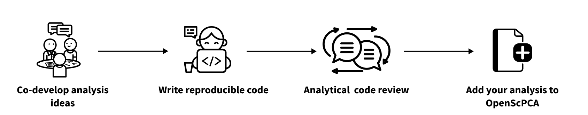

# Welcome to OpenScPCA

OpenScPCA is an open, collaborative project to analyze data from the [Single-cell Pediatric Cancer Atlas (ScPCA) Portal](https://scpca.alexslemonade.org/), which currently holds 500 samples from over 50 pediatric cancer types.

This project aims to:

- Characterize the ScPCA data with analyses such as labeling cell types or identifying recurrent cell states in multiple tumor types

- Work on open and collaborative analyses.

- Build consensus around usage, strengths, and pitfalls of methods and their application to pediatric cancer data.

- Improve the utility of the ScPCA data for the research community by exploring the creation of new data assets (e.g., integrated objects).

## How it works

- **Co-develop analysis ideas and approaches**   Participate in discussions with Data Lab members and other contributors to shape analysis ideas and select the best approaches to implement analyses.

- **Write reproducible code to perform analyses**   Work on an analysis module within a reproducible research framework setup for you by the Data Lab using R or Python.

- **Participate in the analytical code review process**   Participate in the code review process to improve your programming skills and gain experience collaborating on a code base.

- **Add your analyses to the project**   Contribute your analysis to benefit the broader pediatric cancer community and build your publicly-facing portfolio of source code contributions.

## Benefits of participating

:material-tools:{ .lg .middle }
**Access to data and tools**

Discover new datasets to advance your research and learn how to use powerful tooling for reproducible research and software development.

:material-account-group:{ .lg .middle }
**Join a supportive community**

Connect with the Data Lab and receive ongoing support from our team throughout the project.
Meet potential collaborators with diverse skill sets and a variety of expertise!

:material-rocket-launch:{ .lg .middle }
**Develop skills and gain experience**

Build your analysis portfolio, develop transferable skills in big data analysis, and gain experience working collaboratively in a large code base.

:material-shape-plus:{ .lg .middle }
**Contribute to impactful research**

Contribute to open science and help build a resource that will benefit a broad community of pediatric cancer researchers.
Plus, you may be part of a future publication!

## Become a contributor

We are seeking contributors with diverse skills and expertise to join the OpenScPCA community.

!!! info inline end
    If you would like support for Windows, please [file an issue](https://github.com/AlexsLemonade/OpenScPCA-analysis/issues/new?assignees=&labels=docs-request&projects=&template=04-docs-request.yml&title=Docs+request%3A) to request Windows support and associated docs.

 
The primary platform for the project is Linux and we're best able to support analyses written in R and Python.
The documentation and analyses modules cater mainly to Linux and Mac platforms, and the above languages.

  
Whether you are a disease expert, a seasoned computational biologist or looking to hone your data analysis skills, we welcome your contributions to OpenScPCA!

Get started by filling out the interest form below.
You will receive an email response with more information and next steps.

[Fill out the interest form](https://share.hsforms.com/1MlLtkGYSQa6j23HY_0fKaw336z0){ .md-button .md-button--primary }

### Other ways to get started

-   :material-forum-outline:{ .lg .middle } __Join the conversation on GitHub Discussions__

    ---

    Ask questions, discuss big picture ideas, brainstorm, and develop plans for analyses.
Read this post on how to use GitHub Discussions for the OpenScPCA project.

    [Learn more](./communications-tools/index.md#github-discussions)

-   :octicons-telescope-24:{ .lg .middle } __Explore an example analysis module__

    ---

    Create a local setup and explore how analysis modules are structured, and play with some simulated data or data from the [ScPCA Portal](https://scpca.alexslemonade.org/).

    [Explore an example module](getting-started/explore-analysis.md)

