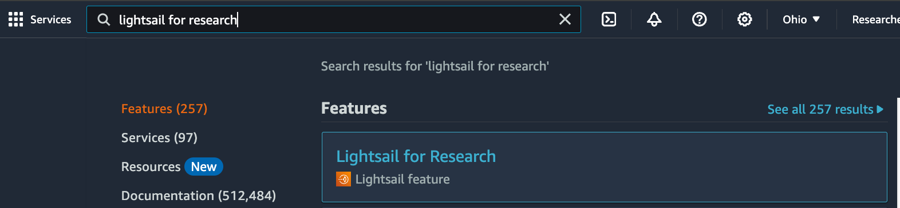
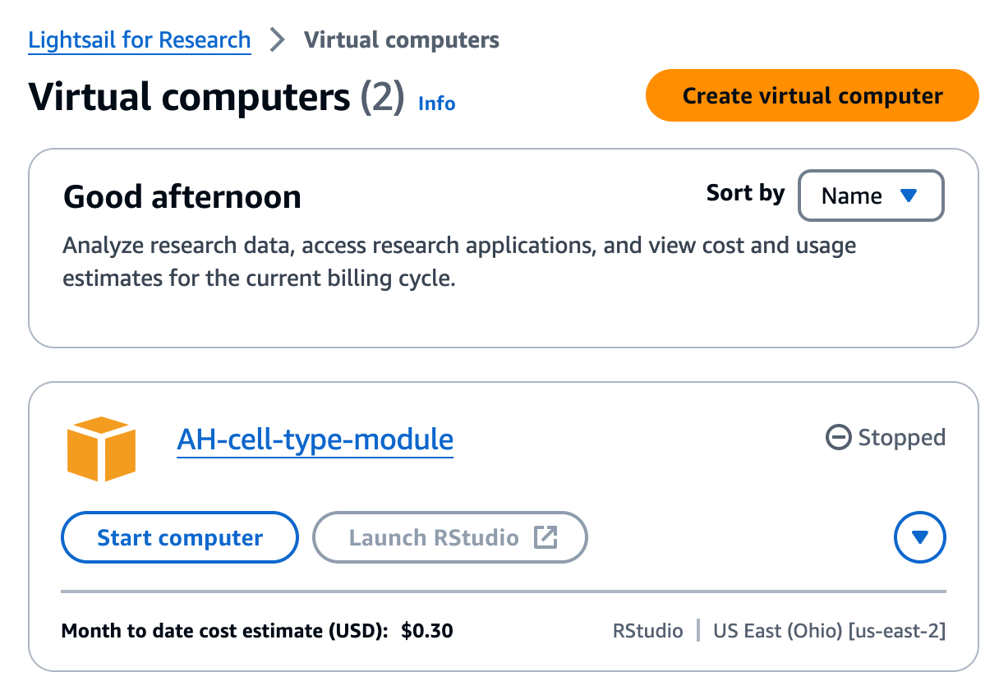
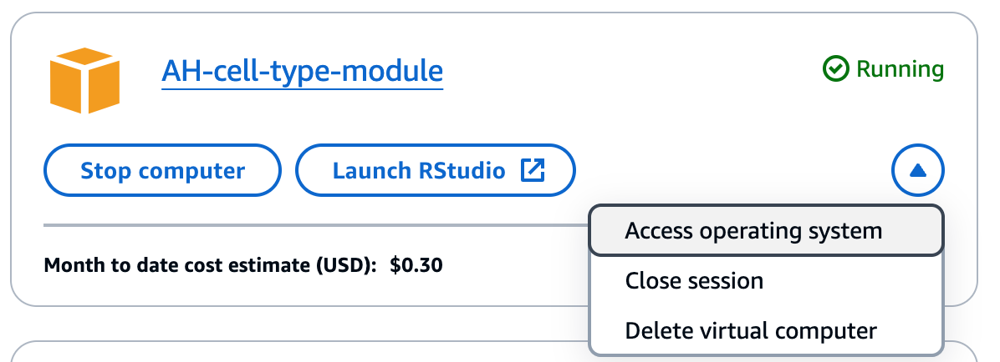

# Accessing virtual computers on Lightsail for Research

Once you have [created your virtual computer](./creating-vcs.md), you will be able to access and launch the computer on a web browser.
We recommend waiting ~10 minutes before accessing the instance.
It takes time to create the instance and for all software to be installed.

1. To access a virtual computer, navigate to Lightsail for Research.
Search for "Lightsail for Research" using the search bar and then select the product.

    <figure markdown="span">
        {width="600"}
    </figure>

    !!! warning
        Be sure to search for "Lightsail for Research" and _not_ just "Lightsail," which is a different product.

1. This will take you directly to a page that lists your virtual computers.
You should see the virtual computer you created with the instance name that you provided during set up.

    <figure markdown="span">
        {width="600"}
    </figure>

1. To launch the computer, click `Start computer`.

1. When the computer is ready, you can open a session in a new browser window (you may need to enable pop-ups) using one of two approaches:

    1. Use the drop-down menu on the lower right-hand side to select `Access operating system` to open the Ubuntu Desktop view.
        <figure markdown="span">
            {width="600"}
        </figure>

    2. If applicable, use the `Launch RStudio` and/or `Launch VSCodium` button.
        - Clicking this button will launch _only_ the `RStudio` or `VSCodium` application, respectively, and you will not be able to access other applications from the same browser window.
        - If you need to access additional applications (e.g., GitKraken) you can open a separate window with `Access operating system`.
        Both of these windows can be open simultaneously.
        - Note that because the RStudio and VSCodium applications have built-in terminals, you can always use the terminal directly from them.

        ??? tip "Working with `VSCodium` virtual computers"
            When you launch a `VSCodium` computer via `Access operating system`, you will _not_ be able to use or access VSCodium itself.
            You can only access VSCodium if you use the `Launch VSCodium` button.

            If you need to use both VSCodium and other computer applications (e.g., GitKraken) at the same time, you can have two separate windows open at the same time: One opened with `Access operating system` to be able to use GitKraken, and one opened with `Launch VSCodium` to be able to use VSCodium.

            Note that this is not the same for RStudio.
            Unlike VSCodium, you can open the RStudio application from the Desktop view opened with `Access operating system`.

2. A new window should open in your browser with the Ubuntu desktop view.

See [Working with storage volumes in Lightsail for Research](working-with-volumes.md) and [Getting started with development on Lightsail for Research](starting-development-on-lsfr.md) for next steps.
