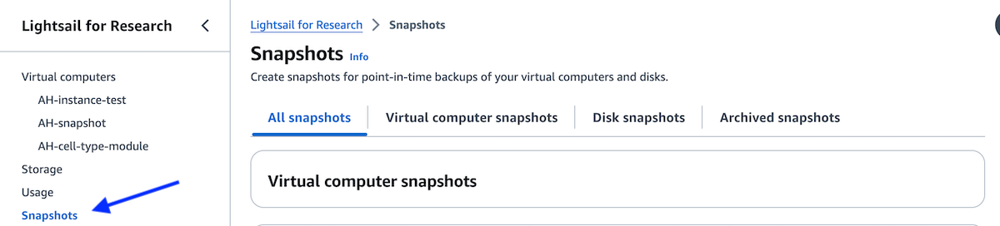
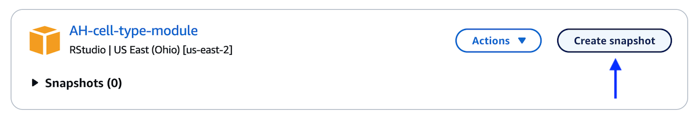
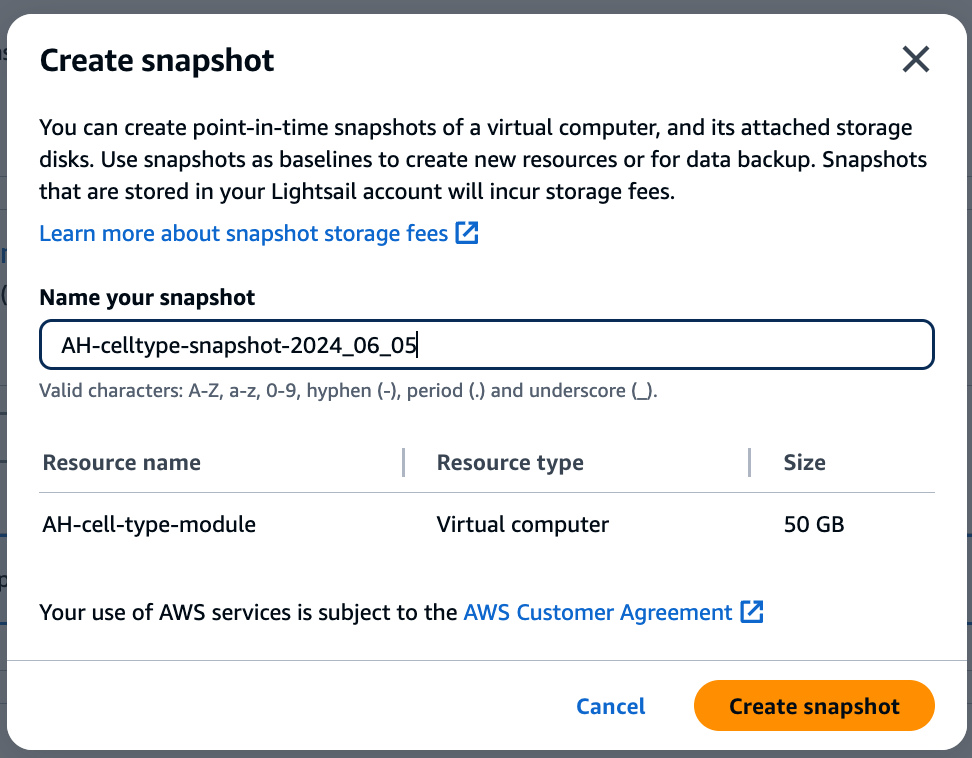
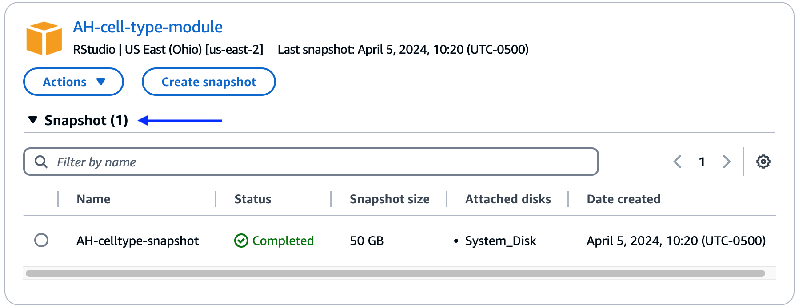
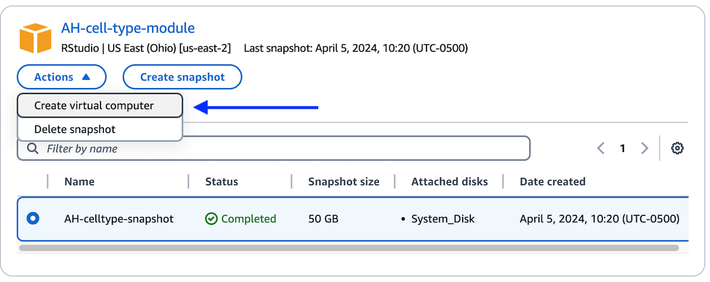
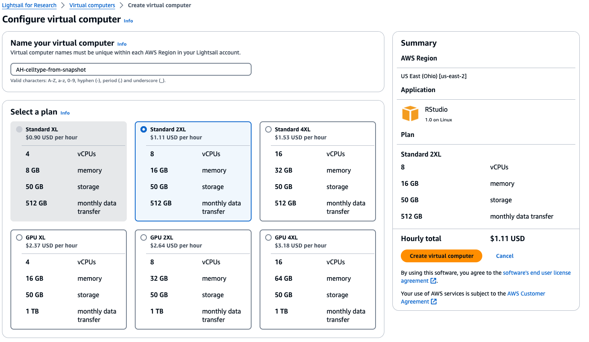

# Working with snapshots on Lightsail for Research

## What is a snapshot

Snapshots of both [virtual computers](./creating-vcs.md) and [disks](./working-with-volumes.md) can be created in Lightsail for Research (LSfR).
You can think of these snapshots as back-ups of your virtual computer or disk.
As with backing up your computer, it is recommended to save snapshots frequently so that no data is lost.

- Snapshots can be used to restore or create a new virtual computer or disk.
This is particularly helpful if you need to restore a virtual computer or disk that has crashed for any reason.
- When restoring a virtual computer from a snapshot, you can change the [instance size and select a different configuration for vCPUs and memory](./creating-vcs.md#choosing-an-instance).
- When restoring a disk from a snapshot, you can change the total storage.

!!! note "More information on snapshots"

    For more information on snapshots see the [AWS documentation on snapshots](https://docs.aws.amazon.com/lightsail-for-research/latest/ug/snapshots.html).

## Creating a snapshot

Follow the below instructions to create a snapshot of a virtual computer or disk.

1. Navigate to the `Snapshots` section of the LSfR console.
Here you will see a list of all your virtual computers, disks, and any existing snapshots.

    <figure markdown="span">
        {width="600"}
    </figure>

1. Choose the virtual computer or disk that you would like to snapshot from the list and select `Create snapshot`.

    <figure markdown="span">
        {width="600"}
    </figure>

1. You will then be prompted to provide a descriptive name for your snapshot.
Once a name has been created, click `Create snapshot`.

    <figure markdown="span">
        {width="600"}
    </figure>

1. Each virtual computer and disk will have a drop-down menu listing all snapshots associated with that virtual computer or disk.
Once your snapshot has been created you should be able to see the snapshot listed in that menu.

    <figure markdown="span">
        {width="600"}
    </figure>

## Creating a new virtual computer or disk from a snapshot

1. Find the previous virtual computer or disk that contains the snapshot you would like to use for creating a new virtual computer or disk.
Open up the snapshot drop-down menu and select the snapshot you would like to use.

1. With the snapshot selected, use the `Actions` drop-down menu to select `Create virtual computer`.
If creating a disk from a disk snapshot, select `Create disk`.

    <figure markdown="span">
        {width="600"}
    </figure>

1. Give your new virtual computer or disk a descriptive name.
Pick the instance size or disk size from the menu options.

    By default, the same instance size or disk size will be selected, but if you would like to re-size please choose a different option from the menu.

    - Reference these [guidelines when choosing an instance size](./creating-vcs.md#choosing-an-instance).
    - Remember that you will have a [monthly budget for any computational resources you use](../../getting-started/accessing-resources/getting-access-to-compute.md#monthly-budget).

    <figure markdown="span">
        {width="700"}
    </figure>

1. Once you have chosen your size, select either `Create virtual computer` or `Create disk`.
Your new virtual computer will be listed under the `Virtual computers` section and new disks can be found in the `Storage` section of LSfR.

If you created a new disk, be sure to [attach your disk to a virtual computer](./working-with-volumes.md#creating-and-attaching-a-disk) before proceeding.
