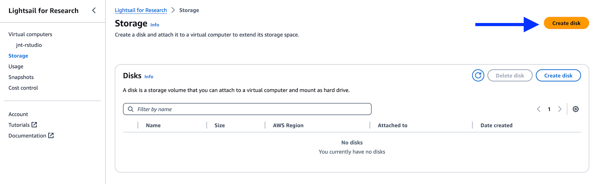
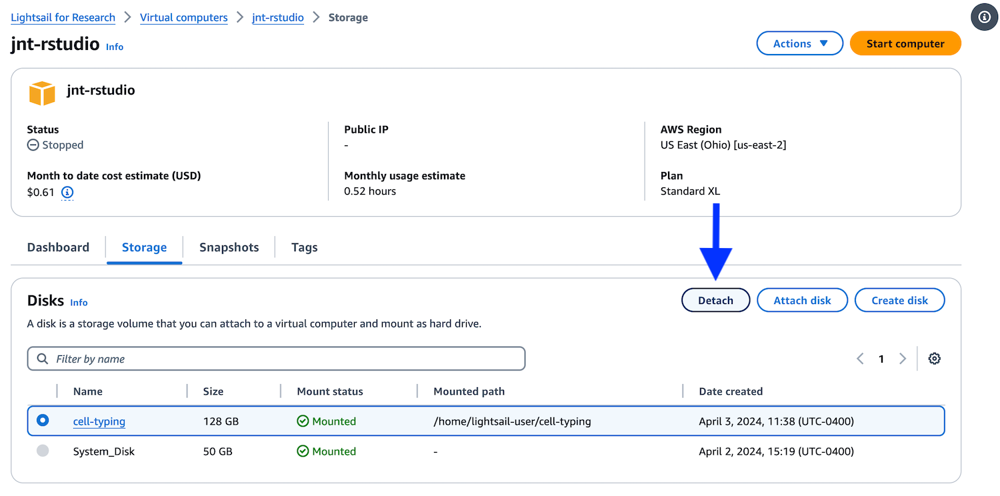

# Working with storage volumes in Lightsail for Research

We recommend attaching disks (also sometimes called storage volumes) to any virtual computers you create in Lightsail for Research (LSfR).
Attaching a disk to your virtual computer will increase its storage capacity.

## Quick tips about disks

- You can only attach your disk to one virtual computer at a time, just like an external hard drive.
- You can only attach a disk to a virtual computer for the first time if the virtual computer is running.
- You can attach multiple disks to the same virtual computer.
- You must detach a disk from a virtual computer before you can delete it.
- Your disk usage [counts towards your monthly AWS budget](../../getting-started/accessing-resources/getting-access-to-compute.md#monthly-budget).

## Creating and attaching a disk

1. Navigate to the `Storage` section of the LSfR console and click the `Create disk` button.

    <figure markdown="span">
        {width="850"}
    </figure>

1. Give your disk a descriptive name, select the `us-east-2` region, pick an appropriate size for your disk, and click `Create disk`.

    <figure markdown="span">
        {width="600"}
    </figure>

1. You can attach a disk to a virtual computer two ways:

    a\. By selecting a virtual computer from the dropdown menu when creating a disk

    <figure markdown="span">
        {width="400"}
    </figure>

    b\. By navigating to the `Storage` tab when viewing the virtual computer in the LSfR Console

    <figure markdown="span">
        {width="750"}
    </figure>

      Clicking attach disk will allow you to select the disk you created from the dropdown menu

    <figure markdown="span">
        {width="400"}
    </figure>

### Disk path

The disk will be mounted in your home directory in your LSfR virtual computer.

If you attached a volume called `cell-typing`, you could use the following command in the terminal to navigate to it:

```sh
cd ~/cell-typing
```

## Detaching and deleting a disk

### Detaching

To detach a disk, navigate to the `Storage` tab of the virtual computer it is attached to, select the disk, and click the `Detach` button.

<figure markdown="span">
    {width="750"}
</figure>

Confirm detaching the disk when prompted.

### Deleting

!!! warning
    Deleting a disk will permanently delete all of the data on it.

Disks can be deleted only once they have been detached from a virtual computer.
To delete a disk, navigate to `Storage`, select the disk, and then click `Delete disk`.

<figure markdown="span">
    {width="750"}
</figure>

Confirm deletion when prompted.
