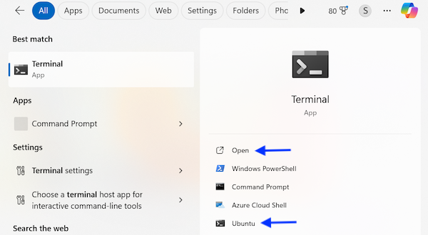
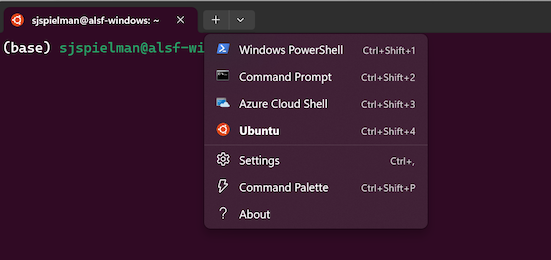
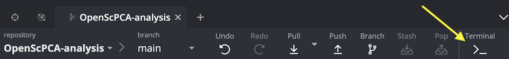

# Using the terminal

This page provides some background information on working with the terminal, also known as the command line prompt.

## What is the terminal?

The terminal is an interface where you can type commands (rather than "point and click") to interact with your operating system.
In the OpenScPCA project, we use the word "terminal" to specifically refer to a UNIX-style terminal, and not for example the Windows PowerShell.

macOS and Linux (which [Lightsail for Research instances](../aws/index.md#lsfr-virtual-computing-with-aws) use) computers come with a built-in terminal application.
At this time, the OpenScPCA project only supports these two operating systems; Support for Windows is not yet provided.
If you would like to see Windows supported, please [let us know by filing an issue](https://github.com/AlexsLemonade/OpenScPCA-analysis/issues/new?assignees=&labels=docs-request&projects=&template=04-docs-request.yml&title=Docs+request%3A).
<!--
On Windows computers, you will first need to install and setup the [Windows Subsystem for Linux (WSL)](STUB_LINK for WSL instructions) to be able to use the terminal.
-->
!!! info "Learn more about the terminal"

    If you are new to the terminal, we highly recommend starting with a general introduction.
    You do not need to become a terminal expert, but it's helpful to have some basic bearings.

    Here are a few resources we suggest.
    Note that while some links have details that are specific to macOS or Linux, the general principles and commands are exactly the same on both kinds of computers!

    - [Introduction to the command line](https://tutorials.codebar.io/command-line/introduction/tutorial.html)
    - [How to Use Terminal on a Mac: A Beginner's Guide](https://www.makeuseof.com/tag/beginners-guide-mac-terminal/)
    - [Video: Using the Terminal on macOS for beginners](https://www.youtube.com/watch?v=dWFMRp6KtlQ)

## When will you need to use the terminal?

There are certain situations that you will need to use a terminal as part of contributing to OpenScPCA, such as:

- [To perform the initial conda setup](../../technical-setup/environment-setup/setup-conda.md)
- [To set up the `pre-commit` package](../../technical-setup/environment-setup/setup-precommit.md)
- [To create a new analysis module](../../contributing-to-analyses/analysis-modules/creating-a-module.md)
- [To manage your environment and software dependencies with conda](../../contributing-to-analyses/determining-requirements/determining-software-requirements.md#managing-software-dependencies-in-python-with-conda)
- [To run an analysis module](../../contributing-to-analyses/analysis-modules/running-a-module.md)

## How do you access the terminal?

You can always access the terminal as its own app, described below for each operating system, or from within certain other applications, as described below.

### Accessing the terminal on a Mac

The macOS Terminal application is stored in `Applications -> Utilities`.
Double-click this application to open the terminal.

Note that [Apple provides some additional instructions](https://support.apple.com/guide/terminal/open-or-quit-terminal-apd5265185d-f365-44cb-8b09-71a064a42125/mac) for opening the terminal too.
(PS: You can also change the look of the terminal by [customizing your terminal profile](https://support.apple.com/guide/terminal/profiles-change-terminal-windows-trml107/mac).)

### Accessing the terminal on WSL2 on Windows

Make sure that you have taken all the necessary steps to [install WSL2](../../technical-setup/install-wsl2.md).

To access the Ubuntu terminal, you can either use either of these applications:

- The "Ubuntu" application, which will launch a Ubuntu terminal.
- The ["Terminal" application](https://learn.microsoft.com/en-us/windows/terminal/)
    - This application opens all types of shells, aka command line prompts, open in the same window.
    If it is not already installed, you can [install Terminal from the Microsoft Store](https://apps.microsoft.com/detail/9n0dx20hk701?rtc=1&hl=en-us&gl=US).
    - You can launch the Ubuntu terminal by clicking "Ubuntu" when searching for this application in the Windows search menu.

        <figure markdown="span">
            {width="300"}
        </figure>
    - Note that the Terminal application can have different tabs for different shells - for example one tab for Ubuntu terminal, and another tab for PowerShell.

        <figure markdown="span">
            {width="300"}
        </figure>

### Accessing the terminal on Lightsail for Research

Lightsail for Research (LSfR) instances run on the Ubuntu operating system, which is a type of Linux.

Take these steps to launch a terminal in LSfR:

1. Click the `Activities` button in the top-left corner.

1. In the search bar that appears, search for "terminal."

1. Click the Terminal app with the _black icon_ to launch the terminal:

<figure markdown="span">
    {width="500"}
</figure>

### Accessing the terminal from other applications

#### GitKraken

You can directly access a terminal within GitKraken on any kind of computer you are using,
The benefit of using the GitKraken terminal is that it always places you in your `OpenScPCA-analysis` repository folder, saving you time from having to navigate to the repository in terminal with the `cd` command.

To launch a terminal in GitKraken, first open your repository in GitKraken.

Then, click the `Terminal` button at the top of GitKraken.
This will open a terminal prompt inside GitKraken where you can type your commands.

<figure markdown="span">
    {width="600"}
</figure>

#### RStudio

You can access RStudio's integrated terminal by clicking on the `Terminal` tab in the Console.
Learn more about using the integrated terminal [from Posit's documentation](https://support.posit.co/hc/en-us/articles/115010737148-Using-the-RStudio-Terminal-in-the-RStudio-IDE).

??? "Working on Windows with WSL?"
    If you are working on a Windows computer with WSL, you will access this terminal from the [RStudio Server](../../technical-setup/environment-setup/install-r-rstudio.md#using-the-rstudio-server) you launch in your browser.

#### Visual Studio Code (VS Code)

[VS Code](https://code.visualstudio.com/) is a powerful text editor that you may use while contributing to OpenScPCA.
[Follow these instructions](https://code.visualstudio.com/docs/terminal/basics) to use its integrated terminal.

??? "Working on Windows with WSL?"
    If you are working on a Windows computer with WSL, you should also [install the WSL extension](https://marketplace.visualstudio.com/items?itemName=ms-vscode-remote.remote-wsl) to be able to open files and run code within WSL.
    Learn more about [working with VS code from WSL from this documentation](https://code.visualstudio.com/docs/remote/wsl-tutorial).

    To launch VS Code from the Ubuntu terminal, run the command [`code`](https://code.visualstudio.com/docs/editor/command-line) in Ubuntu in the directory you want to open.
    The first time you run this command, the VS Code `code` helper will install; then, you can use it to launch VS Code.
