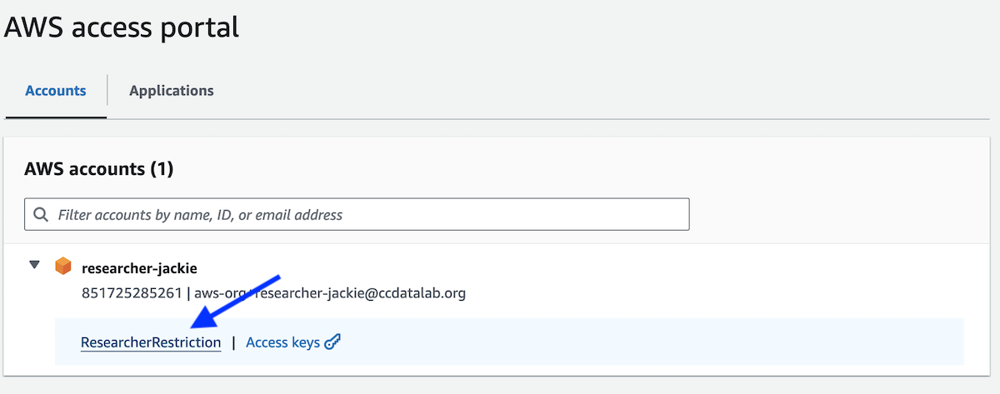
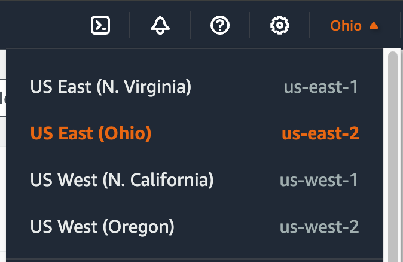
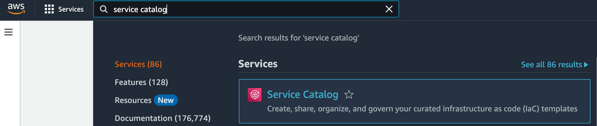
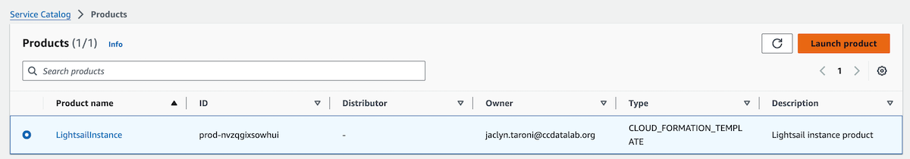
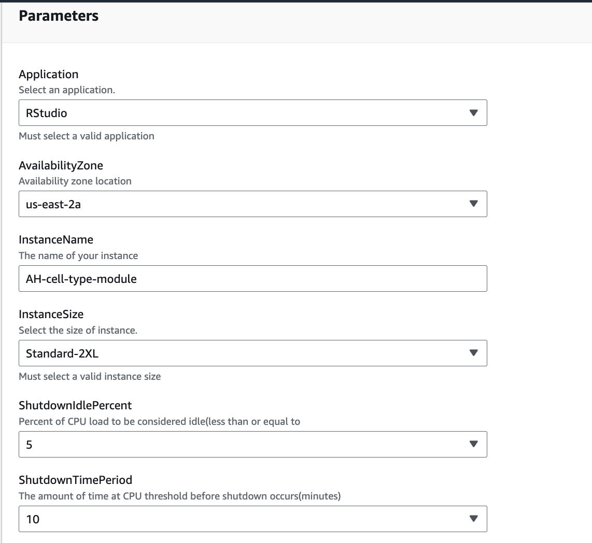

# Creating virtual computers with Lightsail for Research

While working on an [analysis module](../../contributing-to-analyses/analysis-modules/index.md), you can develop locally or on a virtual computer with Lightsail for Research (LSfR).

Virtual computers provide access to a set amount of virtual CPUs (vCPUs), memory, and storage through a web browser rather than a physical machine.
Using a virtual computer allows you to develop and run analyses that require more CPUs and memory than is available on your local machine.

!!! note

    You will need access to AWS to use LSfR.
    See [getting access to AWS](../../getting-started/accessing-resources/index.md#getting-access-to-aws) to learn how to get set up with AWS.

- The virtual computers provided through LSfR use an Ubuntu operating system.
- During setup, you will choose your desired configuration, including the amount of virtual CPUs, memory, and storage space.
    - You also have the option to add [additional storage to your virtual computer](STUB-LINK for volumes).
- All virtual computers will have a set of pre-installed applications needed for working with OpenScPCA, including:
    - Git and GitKraken
    - The AWS command line interface, which has already been configured for you
    - R
    - Conda

!!! tip "More on virtual computers"

    Read more about [virtual computers with Lightsail for Research](https://docs.aws.amazon.com/lightsail-for-research/latest/ug/computers.html).

## How to create a virtual computer

Follow the below steps to create a virtual computer to use with LSfR.

1. Navigate to the [access portal URL from when you set up your user in IAM Identity center](../aws/index.md#joining-iam-identity-center).
This link should bring you to the AWS Console and home page.

    Once here, be sure that you are in the `us-east-2` region, by selecting the drop-down menu in the tool bar.

    <figure markdown="span">
        {width="400"}
    </figure>

1. You will need to use the AWS Service Catalog to create virtual computers.
Creating an instance via LSfR is _not supported_.

    Open the AWS Service Catalog by using the search bar and typing, `service catalog`.

    <figure markdown="span">
        {width="600"}
    </figure>

1. Select `LightsailInstance` in the product list, and click `Launch product`.

    <figure markdown="span">
        {width="600"}
    </figure>

1. You will then choose the name and configurations for your virtual computer.

    - Start by providing a `Provisioned product name`.
    <!--TODO Do we want to provide guidance on names?-->
    - Pick an `Application` to use from the drop-down menu.
    This installs any additional applications along with the pre-installed applications.
        - If you are planning to develop in R, we recommend choosing `Rstudio`, which includes RStudio.
        - If you are planning to develop in Python, we recommend choosing `VSCodium`, which includes VSCodium, a distribution of Microsoft's editor VS Code.
        - For information on all application options, see [the LSfR documentation on Applications](https://docs.aws.amazon.com/lightsail-for-research/latest/ug/blueprints-plans.html).
    - Choose the `us-east-2a` availability zone.
    - Name your instance.
    It might be helpful to use the same name as the provisioned product.
    - Pick the size for your instance.
        - See the [table below outlining the total vCPUs and memory included with each instance size](#choosing-an-instance) to choose the most appropriate instance.
    - Set the `ShutdownIdlePercent` to 5 and the `ShutdownTimePeriod` to 10.
    This means if the instance is using less than 5% of the total available CPUs or inactive for more than 10 minutes, the instance will temporarily shut down.
    This _does not_ delete your instance; it temporarily stops any idle instances until you are ready to resume your work.

    <figure markdown="span">
        {width="600"}
    </figure>

1. Once you have configured your instance, click `Launch product`.
You have now created a virtual computer!

### Choosing an instance

When creating your virtual computer, you will need to choose the instance size.
This specifies the total vCPUs and memory (RAM) available for use in your virtual computer.
All virtual computers will come with 50 GB of storage space.

- Remember that you will have a [monthly budget for any computational resources you use](../../getting-started/accessing-resources/getting-access-to-compute.md#monthly-budget).
- Before you request a plan with GPUs, you will need to put in a [request with the Data Lab team](../../getting-started/accessing-resources/getting-access-to-compute.md#gpu-instance-access).

Use the below table to help pick the most appropriate instance type for your computing needs:

| Name | vCPU | RAM | Hourly price (us-east-2) |
|------|------|-----|--------------------------|
| Standard-XL | 4 | 8 GB | $0.90 |
| Standard-2XL | 8 | 16 GB | $1.11 |
| Standard-4XL | 16 | 32 GB | $1.53 |
| GPU-XL | 4 | 16 GB | $2.37 |
| GPU-2XL | 8 | 32 GB | $2.64 |
| GPU-4XL | 16 | 64 GB | $3.18 |

## How to access a virtual computer

Once you have created your virtual computer, you will be able to access and launch the computer on a web browser.
We recommend waiting ~10 minutes before accessing the instance.
It takes time to create the instance and for all software to be installed.

1. To access a virtual computer, you will need to navigate to Lightsail for Research.
Search for Lightsail for Research using the search bar and then select the product.

    <figure markdown="span">
        {width="600"}
    </figure>

1. This will take you directly to a page that lists your virtual computers.
You should see the virtual computer you created with the instance name that you provided during set up.

    <figure markdown="span">
        {width="600"}
    </figure>

1. To launch the computer, click `Start computer`.
When the computer is ready, use the drop-down menu in the lower right-hand side to select `Access operating system`.

    <figure markdown="span">
        {width="600"}
    </figure>

    You can also use `Launch Rstudio` or `Launch VSCodium`, but if you do that you will have access to _only_ that application instead of the Ubuntu desktop and all installed applications.

1. A new window should open in your browser with the Ubuntu desktop view.
You can now continue to [develop analysis using your virtual computer](STUB_LINK to developing with LSfR).
