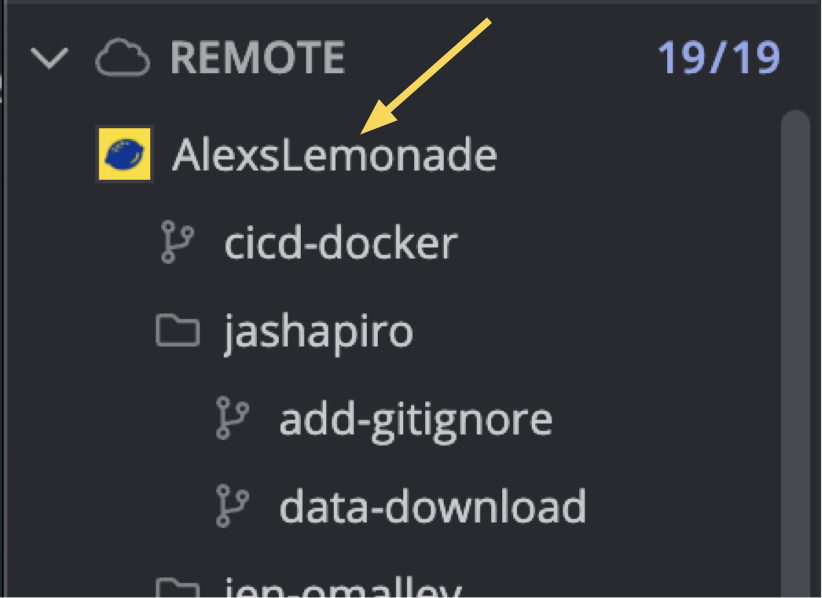

# Clone the repository

After [forking the `OpenScPCA` repository](./fork-the-repo.md), you will need to _clone_ your forked repository to your computer.
Cloning provides you with a local copy of the repository to work with.
You will need to clone the repository to every computer (or remote server) you want to use to contribute to the project.

!!! note
    You should clone your forked repository from `<username>/OpenScPCA-analysis`, _not_ `AlexsLemonade/OpenScPCA-analysis`.

## Clone your forked repository

Please follow the [instructions in this GitKraken video](https://help.gitkraken.com/gitkraken-client/open-clone-init/#cloning-an-existing-project) to clone your repository.

This video presents two approaches to cloning: `Clone with URL`, and Clone based on your integrated `GitHub.com` account.
Either approach is fine to take!

While watching these instructions, please bear in mind the following:

- Do not change the "Full path" field when cloning.
You should retain the folder name `OpenScPCA-analysis`.
- You can feel free to ignore all references to `LFS` ("large file storage") in this video.
This does not apply to `OpenScPCA-analysis`.

## Add the project repository as a remote repository

The next step is to link the upstream repository (`AlexsLemonade/OpenScPCA-analysis`) as a remote.
A _remote_ is a repository on GitHub.com that you are connected to.
Each remote repository is given a name to make referring to them easier.
For example, your forked repository on GitHub.com is called `origin` because it is where your local repository was cloned from.

We will add another remote repository named `upstream` that refers to the original `AlexsLemonade/OpenScPCA-analysis` repository on GitHub.com.
This will be called `upstream` because it was the source that your fork came from.

Adding the `AlexsLemonade` _upstream remote_ will allow you to interact with it from your computer which can help you keep your fork in sync with the `OpenScPCA` project.
But, you will still be working in your fork when writing analysis code.

Follow these steps to add the upstream remote:

1. From your repository in GitKraken, hover over the `1/1` text on the left-hand side `Remote` menu.
This text will then turn into a plus-sign icon.
Click that icon.
{width="600"} <!-- No new line above, to keep tabbed in -->

2. The following screen will prompt you to add a remote.
Select `AlexsLemonade/OpenScPCA-analysis` from the dropdown menu, and click the button `Add remote`.
{width="400"} <!-- No new line above, to keep tabbed in -->

3. You should then see a second remote called `AlexsLemonade` on the left-hand side `Remote` panel.
The specific listed items under this remote that you see will look different from the screenshot below; this is expected.
As long as you see that `AlexsLemonade` is listed in the menu, you have successfully added the upstream remote.
{width="325"} <!-- No new line above, to keep tabbed in. Width needs to be >=325 for proper spacing, it seems. -->
