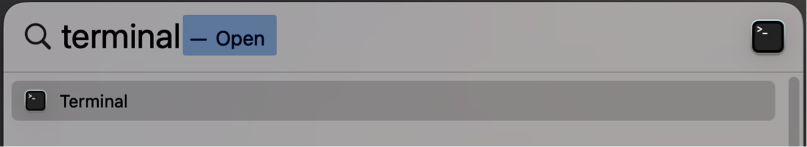

# Install and setup `conda`

## What is `conda`?

The `OpenScPCA` project uses [`conda`](https://docs.anaconda.com/free/miniconda/index.html) to setup your software environment.
`conda` is a command-line software management tool which helps you install and track specific versions of software in many programming languages.

This page provides instructions on how to install `conda` and use it to install certain software you will need to contribute to `OpenScPCA`.

### Why use `conda`?

There are two main reasons we use `conda` for `OpenScPCA`:

- `conda` provides a "one stop shop" for installing lots of different software
    - Rather than having to figure out how to install every new software on its own, `conda` can handle it all for you.
    - You'll use `conda` to install the software dependencies you'll need to contribute to `OpenScPCA`.
- `conda` allows you set up different software environments for different projects
    - For example, you may have two projects that require different versions of the same package.
    With `conda`, you can create separate, fully isolated software environments for each project with different package versions.
    - Python-based `OpenScPCA` analysis modules will use different `conda` environments to prevent conflicts and improve reproducibility.

## Install `conda`

We recommend installing [Miniconda](https://docs.anaconda.com/free/miniconda/index.html) to obtain `conda`.
Miniconda is lightweight version of the full `conda` platform and includes the `conda` tool itself, Python, and a few other commonly-used packages.

To install Miniconda, [download the installer for your operating system](https://docs.anaconda.com/free/miniconda/miniconda-install/), and follow all instructions.

If you already have `conda` on your system, you do not need to re-install it.

## Setup `conda`

Next, you will need to set certain `conda` settings and install a few packages that will allow you to contribute to `OpenScPCA` in general.

1. Open a prompt to interact with `conda`.
The application to open depends on your operating system:
    - _If you are on a macOS machine_, open the `Terminal` application.
    To launch `Terminal`, search for "terminal" in spotlight and open the application.
    <figure markdown="span">
        {width="425"}
    </figure>

    - _If you are on a Windows machine_, open the `conda` prompt.
    To launch the prompt, SOMETHING SOMETHING START MENU.
    TODO: Add screenshot.

1. Copy and paste the following code into the prompt, and hit enter.
These commands will set the [recommended channels](https://docs.conda.io/projects/conda/en/latest/user-guide/concepts/channels.html) `conda` should use to search for software. <!-- For an indented code block, no backticks - just tab in twice -->

        conda config --add channels defaults
        conda config --add channels bioconda
        conda config --add channels conda-forge
        conda config --set channel_priority strict

    !!! info
        If you are on a macOS machine and get the error `conda: command not found`, this means `conda` was not properly installed.
        Please DO SOMETHING TO GET HELP? IS IT OPEN A DISCUSSION? IS IT DM US? IS IT SEE OTHER DOCS FOR WAYS TO GET HELP?
        OR DO WE NOT EVEN NEED THIS NOTE?

    !!! note
        You may be prompted to enter `y` or `n` (yes or no) during this setup.
        If/when this prompt appears, you should hit `y` to give `conda` permissions to proceed.

1. The last step is to add the packages to your base `conda` environment that you will need to contribute to `OpenScPCA`.
Copy and paste the following command into `Terminal`, and hit enter.

        conda install awscli jq pre-commit

    - The [`awscli` package](https://pypi.org/project/awscli/) will allow you to interact with [data stored in the Amazon Web Services (AWS) S3 bucket](STUB_LINK)
    - The [`jq` package](https://pypi.org/project/jq/) provides JSON parsing capabilities
    - The [`pre-commit`](https://pypi.org/project/pre-commit/) package will allow you to use [pre-commit hooks when contributing to analysis modules](STUB_LINK)

All set!
You can now safely close the prompt.
