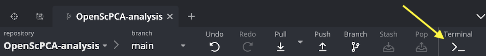

# Set up pre-commit

## What is pre-commit?

[`pre-commit`](https://pre-commit.com/) is a small software package that makes it easy to manage and run code quality checks.
`pre-commit` checks code quality by defining a set of "hooks," called pre-commit hooks, that will automatically run every time you commit changes to a repository.

These pre-commit hooks check that the changes you are trying to commit pass the code quality standards we have set up.

If `pre-commit` finds that certain files that do not pass these checks, you will need to update the files to ensure they pass.
You can learn more about this process in the [contributing to analyses documentation](STUB_LINK).

## How does OpenScPCA use pre-commit?

All OpenScPCA contributors should use `pre-commit` as part of their workflow.

We have set up some pre-commit hooks to manage basic code security and catch other common problems, such as the following:

- Large data files that should not be committed to the repository
- [Merge conflicts](STUB_LINK resolving merge conflicts) that have not yet been resolved
- Credential files and other sensitive information


## Setting up pre-commit

During [conda setup](./setup-conda.md), you should have installed the `pre-commit` software into your base environment.

To turn on the pre-commit hooks for the OpenScPCA repository, you will need run the command `pre-commit install` from a terminal window inside the repository.

Please follow these steps to do this:

1. Open your `OpenScPCA` repository in GitKraken.


1. Click the `Terminal` button at the top of GitKraken.
This will open a terminal prompt inside of GitKraken where you can issue command-line commands. <!-- TODO: Note this in case we need it for windows setup: https://help.gitkraken.com/gitkraken-client/terminal/#setting-the-default-terminal-on-windows -->

    <figure markdown="span">
        {width="600"}
    </figure>

1. Type this command in the terminal prompt, and hit enter:

    ```
    pre-commit install
    ```

1. Terminal should then return this output message showing that you successfully set up your pre-commit hooks:

    ```
    pre-commit installed at .git/hooks/pre-commit
    ```

All set! 🎉
