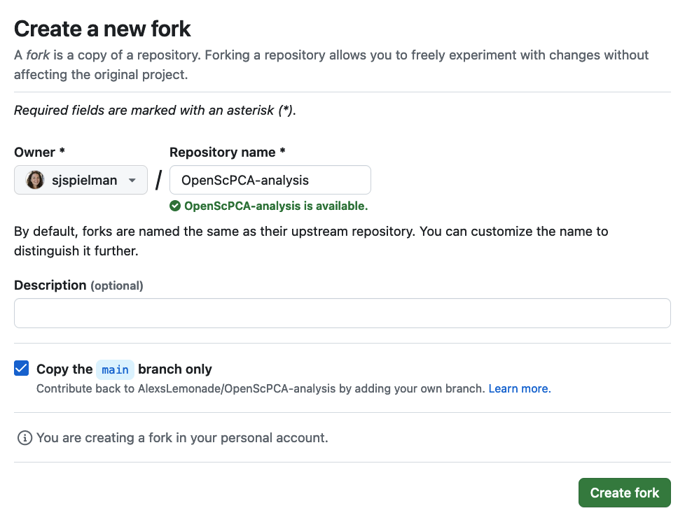

# Fork the repository

You will need to create a [_fork_](https://docs.github.com/en/pull-requests/collaborating-with-pull-requests/working-with-forks/fork-a-repo#about-forks) of the [`OpenScPCA-analysis`](https://github.com/AlexsLemonade/OpenScPCA-analysis/) repository.

A fork is a copy of an _upstream_ repository (here, `AlexsLemonade/OpenScPCA-analysis` is the _upstream_) that you will own and will be in your GitHub account.
As a contributor, you will perform analyses in your fork.
Just like the upstream `AlexsLemonade/OpenScPCA-analysis` repository, your fork will also be a public repository.

One benefit of using a fork is that changes you make will not affect the upstream project in `AlexsLemonade/OpenScPCA-analysis`.
This means you can safely work on your analyses without worrying about messing anything up in the upstream repository.
Periodically, you will request to add your analysis code to the upstream repository through a [_pull request_](STUB_LINK) process.

## Create your fork

Follow these steps to create your fork:

1. In your browser, navigate to the `OpenScPCA-analysis` repository: [https://github.com/AlexsLemonade/OpenScPCA-analysis/](https://github.com/AlexsLemonade/OpenScPCA-analysis/).

1. At the top right corner, click the "Fork" button:
(The numbers you see in this screenshot may differ from the numbers on the website - that's ok!)
{width="400"} <!-- No new line above, to keep tabbed in -->

1. On the next screen, GitHub will prompt you for some settings about your fork.
Make sure that these conditions are met, and then click the "Create fork" button on the bottom right.
    - Although the screenshot below shows an "Owner" username of `sjspielman`, you should see your username in this field.
    - Keep the default Repository name as `OpenScPCA-analysis`.
    - The box "Copy the `main` branch only" is checked
    - You can add a description if you want, but it is not necessary.
{width="600"} <!-- No new line above, to keep tabbed in -->

1. That's it! 🎉
In a few moments, `GitHub` will redirect to your newly forked repository at `https://github.com/YOUR_USERNAME/OpenScPCA-analysis`, and you're ready to proceed to the next step of [cloning your repository](./clone-the-repo.md).
